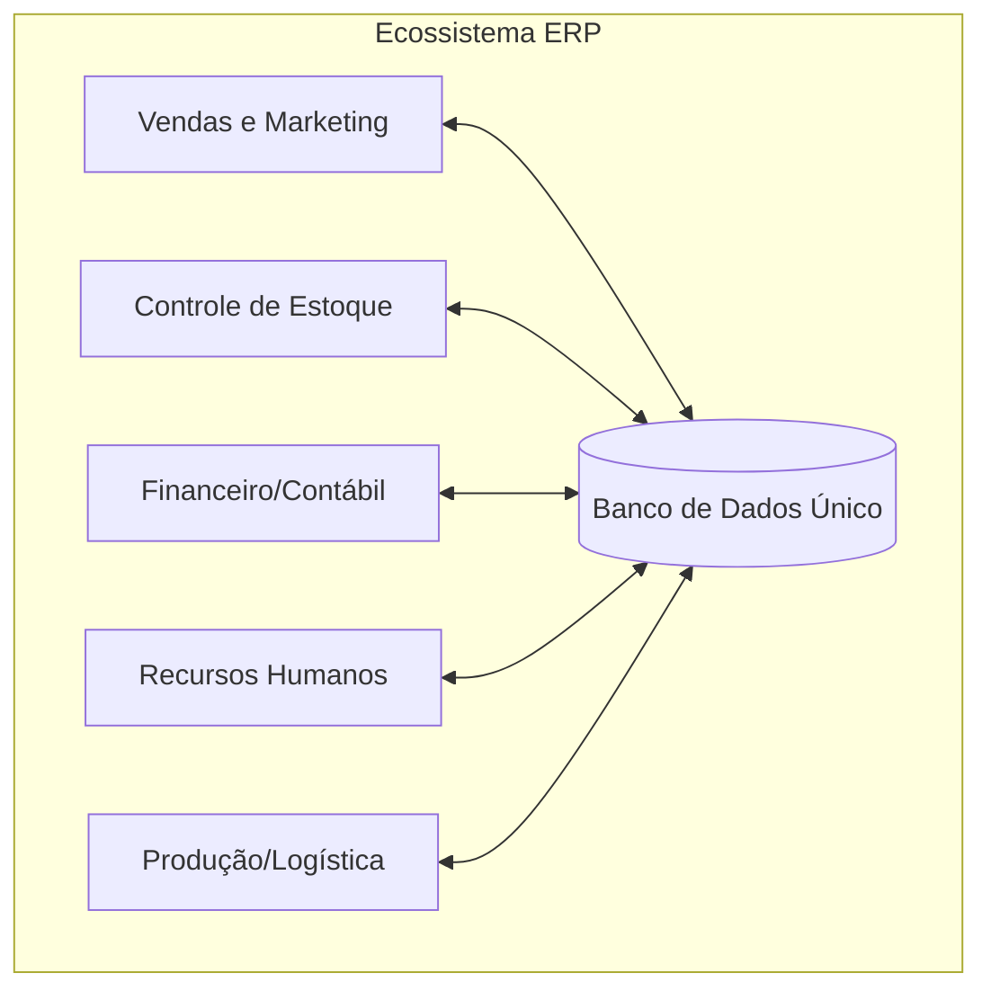

# Aula 01 - Introdução aos Sistemas de Gerenciamento 🏢

!!! tip "Objetivo"
    **Objetivo**: Compreender o conceito de sistemas de gerenciamento integrados, identificar a evolução histórica das ferramentas de gestão e entender o papel do ERP na administração moderna.

---

## 1. O que são Sistemas de Gerenciamento? 🧩

Sistemas de gerenciamento são softwares projetados para coletar, processar e distribuir informações que suportam as atividades de uma organização. Eles permitem que diferentes setores (vendas, estoque, financeiro) "falem o mesmo idioma".

### 🏛️ A Evolução da Gestão
Historicamente, as empresas utilizavam sistemas isolados para cada departamento, o que gerava duplicidade de dados e erros de comunicação.

*   **Década de 70**: Controle de Estoque (MRP).
*   **Década de 80**: Planejamento de Recursos de Manufatura (MRP II).
*   **Década de 90 até hoje**: Enterprise Resource Planning (**ERP**).

---

## 2. O conceito de ERP (Enterprise Resource Planning) 🏗️

O **ERP** é um software de gestão empresarial que integra todos os dados e processos de uma organização em um único sistema. 

### 🌟 Características Principais
*   **Integração**: Os dados inseridos em um módulo (ex: Vendas) atualizam automaticamente outros (ex: Estoque e Financeiro).
*   **Banco de Dados Único**: Evita a fragmentação da informação.
*   **Modularidade**: O sistema é composto por módulos específicos (Finanças, RH, Produção).

### Estrutura de Integração (Mermaid)



---

## 3. Tipos de Sistemas de Gerenciamento ⚖️

Além do ERP central, as organizações utilizam tecnologias complementares:

| Tipo | Sigla | Foco Principal |
| :--- | :--- | :--- |
| **Relacionamento** | **CRM** | Gestão de clientes e funil de vendas. |
| **Inteligência** | **BI** | Análise de dados e suporte à decisão. |
| **Suprimentos** | **SCM** | Gestão da cadeia de suprimentos e fornecedores. |

---

## 4. O Impacto da TI na Administração 🚀

A Tecnologia da Informação (TI) deixou de ser apenas um "suporte técnico" para se tornar o **coração estratégico** da empresa.

!!! info "Conceito Chave"
    A integração sistêmica reduz custos operacionais, agiliza a entrega de produtos e permite uma visão em tempo real da "saúde" da organização.

---

## 5. Visualizando o Fluxo de Trabalho Integrado 💻

Imagine o processo de venda de um produto em um sistema moderno:

```termynal
$ iniciar-venda --cliente "João Silva" --item "Laptop"
[OK] Verificando estoque... Disponível (15 unidades)
[OK] Processando pagamento... Autorizado (NFe gerada)
[OK] Ativando logística... Pedido enviado para separação
$ status-gerencial --hoje
Relatório: 1 venda realizada | Estoque: 14 unidades | Caixa: +R$ 4.500,00
```

---

## 6. Mini-Projeto: Mapeamento de Processos 🚀

Sua missão é atuar como um consultor de TI Administrativa:

1.  Escolha uma empresa pequena (ex: uma padaria ou loja de roupas).
2.  Identifique **3 departamentos** diferentes.
3.  Descreva **1 exemplo de dado** que um departamento gera e que seria útil para o outro.
    *   *Exemplo*: Vendas vendeu um pão -> Estoque precisa saber para baixar a farinha.

---

## 7. Exercício de Fixação 🧠

Responda em seu caderno/arquivo de notas:

1.  Defina com suas palavras o que é um sistema ERP.
2.  Qual a principal diferença entre um sistema MRP antigo e um ERP moderno?
3.  Por que a centralização de dados em um banco de dados único é considerada a maior vantagem de um sistema de gestão?

---

**Próxima Aula**: Vamos explorar o ecossistema estratégico de [CRM e BI](./aula-02.md)! 🏗️
