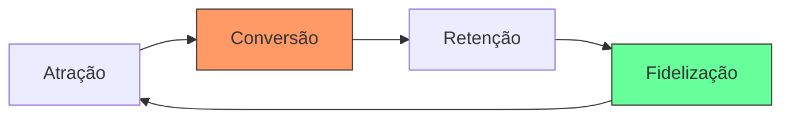

# Aula 02 - CRM, Business Intelligence e Integração 📈

!!! tip "Objetivo"
    **Objetivo**: Compreender como o CRM e o BI potencializam os sistemas de gestão, entender a integração entre essas ferramentas e a importância da análise de dados para o sucesso administrativo.

---

## 1. CRM: Gestão do Relacionamento com o Cliente 🤝

O **CRM** (*Customer Relationship Management*) não é apenas um software, mas uma estratégia de negócio focada em entender e antecipar as necessidades dos clientes.

### 🎯 Funções do CRM no Dia a Dia
*   **Centralização de Contatos**: Histórico completo de interações.
*   **Gestão do Funil de Vendas**: Acompanhamento de oportunidades desde o primeiro contato até o fechamento.
*   **Automação de Marketing**: Campanhas personalizadas baseadas no perfil do cliente.

### O Ciclo do Cliente no CRM (Mermaid)



---

## 2. Business Intelligence (BI): Dados em Inteligência 🧠

O **BI** é o processo de coleta, organização e análise de dados para suporte à tomada de decisão. Ele transforma o "mar de dados" do ERP em visualizações claras.

### 📊 Componentes do BI
1.  **Data Warehouse**: Um armazém de dados limpos e organizados.
2.  **Dashboards**: Painéis visuais com indicadores chave de desempenho (KPIs).
3.  **Analytics**: Descoberta de padrões e tendências futuras.

---

## 3. A Sinergia: ERP + CRM + BI 🔗

Para uma administração de alta performance, essas três ferramentas devem trabalhar juntas:

| Ferramenta | Papel | Pergunta que Responde |
| :--- | :--- | :--- |
| **ERP** | Operacional | "Quanto temos no estoque agora?" |
| **CRM** | Comercial | "Quem são nossos clientes mais fiéis?" |
| **BI** | Estratégico | "Qual será a demanda no próximo mês?" |

---

## 4. Visualizando a Integração no Terminal 📂

Como um gestor acessa essas informações de forma agregada:

```termynal
$ dashboard-comercial --resumo-semanal
[CARREGANDO] Sincronizando ERP (Vendas) e CRM (Leads)...
--------------------------------------------------
TOTAL VENDAS: R$ 125.000,00 (+12% vs semana anterior)
NOVOS LEADS NO CRM: 45
CONVERSÃO: 8% 
KPI ALERTA: Estoque de 'Produto A' abaixo do mínimo (Ação: ERP)
--------------------------------------------------
$ gerar-insight --bi
INSIGHT: Clientes do Sul compram 30% mais nas terças-feiras.
SUGESTÃO: Disparar campanha de e-mail marketing na segunda à noite via CRM.
```

---

## 5. Mini-Projeto: Design de Dashboard 🚀

Como administrador, você precisa definir o que é importante medir:

1.  Imagine que você gerencia uma **assinatura de streaming**.
2.  Liste **3 indicadores (KPIs)** que seriam vitais para o seu dashboard de BI.
3.  Explique como o **CRM** ajudaria a melhorar um desses indicadores.
    *   *Exemplo*: KPI "Cancelamentos". O CRM ajuda enviando ofertas de retenção antes do cliente sair.

---

## 6. Exercício de Fixação 🧠

Responda em seu caderno/arquivo de notas:

1.  Diferencie CRM Operacional de CRM Analítico.
2.  Por que o BI depende de uma boa alimentação de dados no ERP?
3.  Dê um exemplo de como uma pequena empresa pode usar o CRM sem investir em softwares caros inicialmente.

---

**Próxima Aula**: Vamos mergulhar nas [Características e Funções Básicas do ERP](./aula-03.md)! 📡
