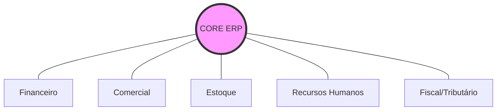

# Aula 03 - Características e Funções Básicas do ERP ⚙️

!!! tip "Objetivo"
    **Objetivo**: Aprofundar o conhecimento técnico sobre a estrutura de um ERP, identificar os módulos essenciais e entender as funções básicas que sustentam a pirâmide organizacional.

---

## 1. Características Técnicas de um ERP Profissional 🏗️

Para que um sistema seja considerado um ERP de verdade, ele precisa atender a requisitos técnicos específicos:

*   **Integridade dos Dados**: Uma alteração em um local reflete em todo o sistema.
*   **Não Duplicidade**: A informação é inserida uma única vez.
*   **Segurança por Níveis**: Diferentes usuários têm diferentes permissões de acesso.
*   **Auditabilidade**: O sistema registra "quem", "quando" e "o quê" foi alterado.

---

## 2. A Pirâmide de Módulos Essenciais 💎

Um ERP é como um "Lego" de módulos. Embora cada empresa precise de coisas diferentes, estes são os pilares:

### 💰 Módulo Financeiro
Controla o fluxo de caixa, contas a pagar/receber e contabilidade. É o "cérebro" financeiro.

### 📦 Módulo de Suprimentos (Estoque/Compras)
Gerencia a entrada de mercadorias, níveis críticos de estoque e automação de pedidos de compra.

### 👔 Módulo de RH (Capital Humano)
Folha de pagamento, controle de ponto, benefícios e treinamentos.

### Arquitetura de Módulos (Mermaid)



---

## 3. Funções Básicas e Transacionais 🔄

As **funções básicas** são aquelas que ocorrem no nível operacional da empresa (o "chão de fábrica" ou o "balcão").

*   **Faturamento**: Emissão de notas fiscais e boletos.
*   **Conciliação Bancária**: Bater o saldo do sistema com o saldo do banco.
*   **Movimentação de Estoque**: Registro de entradas e saídas.

---

## 4. O Fluxo de uma Compra no ERP 🚀

Veja como a informação viaja entre os módulos de forma automática:

```termynal
$ pedido-compra --fornecedor "TechCorp" --item "Servidor" --qtd 1
[STATUS] Pedido Gerado (Aguardando Aprovação Gerencial)
$ aprovar-pedido --id 450
[OK] Orçamento aprovado. Notificando Fornecedor...
[OK] Gerando Provisão no Módulo FINANCEIRO (Contas a Pagar)
[OK] Aguardando Nota Fiscal no Módulo ESTOQUE
```

---

## 5. Mini-Projeto: Seleção de Módulos 🚀

Imagine que você foi contratado para implementar um ERP em uma **Clínica Médica**:

1.  Além dos módulos básicos (Financeiro/RH), cite **2 módulos específicos** que essa clínica precisaria.
2.  Descreva uma **função básica** que o sistema deveria automatizar para os médicos.
    *   *Exemplo*: Módulo de "Prontuário Eletrônico". Função: "Agendamento Online".

---

## 6. Exercício de Fixação 🧠

Responda em seu caderno/arquivo de notas:

1.  O que significa dizer que um ERP é um sistema "modular"?
2.  Explique a importância da auditabilidade em um sistema financeiro.
3.  Qual a relação entre o módulo de Vendas e o módulo Fiscal em uma transação comercial?

---

**Próxima Aula**: Vamos iniciar o estudo dos [Fundamentos do Sistema de Informações Gerenciais (SIG)](./aula-04.md)! 📄
