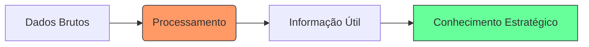

# Aula 04 - Fundamentos do Sistema de Informações Gerenciais (SIG) 📄

!!! tip "Objetivo"
    **Objetivo**: Compreender a definição de SIG, entender sua importância para a organização e diferenciar dados, informações e conhecimento no contexto gerencial.

---

## 1. O que é um SIG? 🧐

O **SIG** (*Sistema de Informações Gerenciais*) é um conjunto de componentes inter-relacionados que coletam, processam, armazenam e distribuem informações para apoiar a tomada de decisões e o controle em uma organização.

### 🧩 Os 3 Pilares do SIG
1.  **Tecnologia**: Hardware, software e bancos de dados.
2.  **Pessoas**: Quem opera o sistema e quem consome a informação.
3.  **Processos**: As regras de negócio e rotinas da organização.

---

## 2. Dados vs. Informação vs. Conhecimento 🧠

Para um administrador, entender essa hierarquia é fundamental para não se "afogar" em dados inúteis.

*   **Dado**: Um fato bruto, sem contexto (ex: "45").
*   **Informação**: O dado processado e com significado (ex: "Vendemos 45 unidades hoje").
*   **Conhecimento**: A informação aplicada para gerar valor ou ação (ex: "A venda de 45 unidades indica que precisamos repor o estoque amanhã").

### Fluxo de Transformação (Mermaid)



---

## 3. A Importância do SIG na Organização 🌟

Sem um SIG eficiente, a empresa opera "no escuro". O SIG traz clareza para:

*   **Redução de Custos**: Identificação de desperdícios em tempo real.
*   **Agilidade**: Respostas rápidas às mudanças do mercado.
*   **Vantagem Competitiva**: Uso de informações que os concorrentes não possuem.
*   **Visão Sistêmica**: Entender a empresa como um todo, não apenas setores isolados.

---

## 4. O SIG em Operação no Terminal 🚀

Como o sistema transforma dados operacionais em visão gerencial:

<!-- termynal -->
```bash
$ sig-analisar --vendas-junho
[PROCESSANDO] Lendo 5.000 transações do ERP...
[CONTROLANDO] Aplicando regras de negócio e metas...
--------------------------------------------------
STATUS: Meta atingida em 92%
TENDÊNCIA: Queda de 15% em eletrodomésticos
DADO BRUTO: 1.200 (Vendas de Airfryer)
INFORMAÇÃO: 80% das Airfryers foram vendidas com cupom de desconto.
CONHECIMENTO: O cliente só compra esse item se houver promoção ativa.
--------------------------------------------------
$ sig-gerar-alerta --gerencia
ALERTA: Sugerimos revisão da margem de lucro para a categoria 'Cozinha'.
```

---

## 5. Mini-Projeto: Identificando Falhas de Informação 🚀

Atue como um analista de SIG:

1.  Imagine que um gerente de estoque diz: *"Eu sei que tenho muito produto, mas não sei qual deles está parado há mais tempo"*.
2.  Qual o **Dado** que falta?
3.  Como o **SIG** transformaria esse dado em uma **Informação** útil para o gerente?
    *   *Exemplo*: O dado é a "Data da última venda". A informação é o "Relatório de itens sem giro há 90 dias".

---

## 6. Exercício de Fixação 🧠

Responda em seu caderno/arquivo de notas:

1.  Explique por que um SIG não é apenas "um software de computador".
2.  Dê um exemplo de dado que, se mal processado, gera uma informação perigosa para a empresa.
3.  Qual o papel do banco de dados na estrutura de um SIG?

---

## 🔗 Materiais da Aula

<div class="grid cards" markdown>
- :material-presentation: **Slides**

    ---

    Material visual com diagramas e conceitos-chave.

    [:octicons-arrow-right-24: Slide 04](../slides/slide-04.html)

- :material-help-circle: **Quiz**

    ---

    Teste seu conhecimento com 10 questões interativas.

    [:octicons-arrow-right-24: Quiz 04](../quizzes/quiz-04.md)

- :fontawesome-solid-pencil: **Exercícios**

    ---

    5 exercícios progressivos (básico → desafio).

    [:octicons-arrow-right-24: Exercício 04](../exercicios/exercicio-04.md)

- :material-briefcase-outline: **Projeto**

    ---

    Aplicação prática dos conceitos da aula.

    [:octicons-arrow-right-24: Projeto 04](../projetos/projeto-04.md)

</div>

---

[➡️ Próxima Aula: Aula 05](./aula-05.md){ .md-button .md-button--primary }
