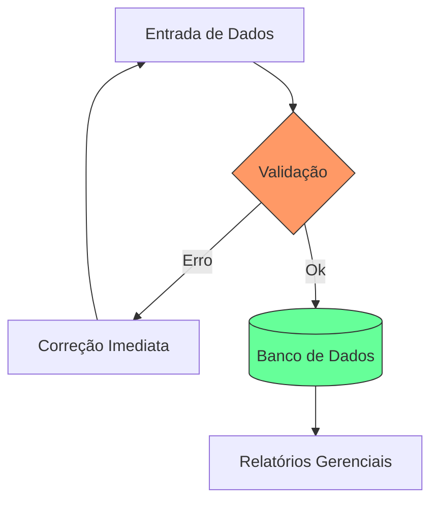

# Aula 05 - O SIG como Ferramenta para Tomada de Decisão 📈

!!! tip "Objetivo"
    **Objetivo**: Entender o papel do SIG no processo de tomada de decisão, identificar os níveis de decisão organizacional e aprender a importância da qualidade dos dados cadastrados no sistema.

---

## 1. O Processo de Tomada de Decisão 🧠

Decidir é o ato de escolher entre várias alternativas para atingir um objetivo. O SIG atua como o **suporte técnico** que reduz a incerteza do administrador.

### 📝 As Fases da Decisão no SIG
1.  **Inteligência**: Identificação do problema ou oportunidade (ex: Estoque baixo).
2.  **Design**: Criação de alternativas (ex: Comprar do fornecedor A ou B?).
3.  **Escolha**: Seleção da melhor opção baseada nos dados (ex: Fornecedor B tem melhor prazo).
4.  **Implementação**: Execução da decisão no sistema.

---

## 2. Níveis de Decisão e o SIG 🏗️

As decisões em uma empresa não são todas iguais. O SIG deve fornecer informações específicas para cada nível:

| Nível | Decisão | Horizonte | Foco do SIG |
| :--- | :--- | :--- | :--- |
| **Estratégico** | Longo Prazo | Anos | Tendências de mercado e novos negócios. |
| **Tático** | Médio Prazo | Meses | Controle de metas por departamento. |
| **Operacional** | Curto Prazo | Dias | Rotinas diárias e tarefas unitárias. |

---

## 3. Cadastro de Informações no SIG 📥

A frase de ouro da computação aplicada à gestão é: *"Garbage In, Garbage Out"* (Lixo entra, lixo sai).

### 🌟 Regras para um Bom Cadastro
*   **Precisão**: O valor deve ser real (ex: R$ 10,50 e não R$ 10,00).
*   **Pontualidade**: A informação deve ser inserida no momento em que ocorre.
*   **Completude**: Não deixar campos obrigatórios vazios.

### Fluxo de Cadastro e Validação (Mermaid)



---

## 4. Simulando uma Decisão no Terminal 📂

Como um gestor operacional utiliza o SIG para decidir sobre reposição:

```termynal
$ sig-checar-produtividade --servidor "Frente de Loja"
[OK] Analisando 1.200 atendimentos hoje...
[ALERTA] Tempo médio de espera: 8 minutos (Meta: 5 min)
$ decidir-acao --alerta "Espera" --alternativas "Abrir PDV, Chamar Supervisor, Ignorar"
[SIG-SUGESTÃO] Abrir PDV 04 (Temos 2 funcionários disponíveis no administrativo)
$ executar-decisao --abrir-pdv 04
[OK] PDV 04 Ativado. Redirecionando fila...
```

---

## 5. Mini-Projeto: Qualidade de Dados 🚀

Atue como um gestor de dados:

1.  Crie um **checklist de 5 campos obrigatórios** para o cadastro de um novo "Fornecedor" no SIG.
2.  Explique o que aconteceria se o campo "Prazo de Entrega" fosse preenchido errado pelo funcionário.
    *   *Exemplo*: O SIG calcularia a reposição de estoque com dados falsos, causando falta de produto.

---

## 6. Exercício de Fixação 🧠

Responda em seu caderno/arquivo de notas:

1.  Diferencie uma decisão tática de uma decisão operacional.
2.  Por que a fase de "Inteligência" é a mais crítica no processo de decisão?
3.  Qual o risco de uma empresa que foca apenas em SIG operacional e ignora o SIG estratégico?

---

**Próxima Aula**: Vamos aprender sobre o [Cadastro, Fluxo e Gestão de Informações no SIG](./aula-06.md)! 💾
