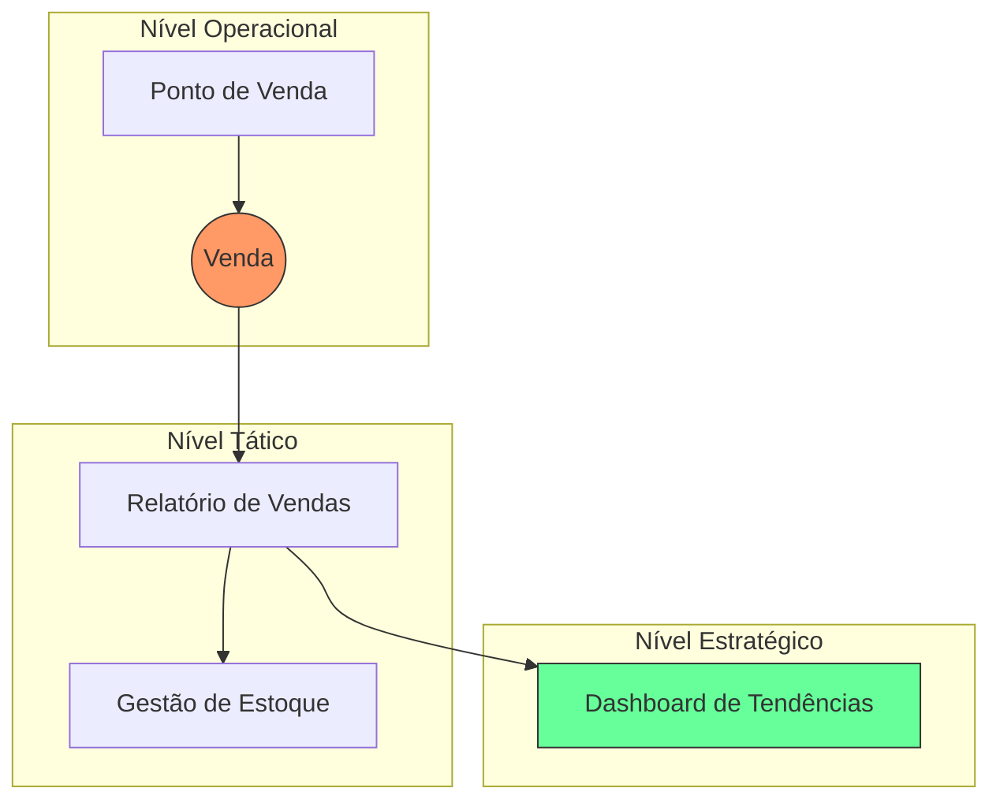

# Aula 06 - Cadastro, Fluxo e Gestão de Informações no SIG 💾

!!! tip "Objetivo"
    **Objetivo**: Compreender o ciclo de vida da informação dentro de um sistema gerencial, aprender a desenhar fluxos de dados eficientes e entender como o cadastro correto impacta a gestão.

---

## 1. O Ciclo de Vida da Informação 🔄

No SIG, a informação não é estática. Ela nasce no cadastro e morre (ou se torna histórica) após o processamento e uso.

1.  **Coleta/Entrada**: O momento do cadastro (ex: Venda realizada).
2.  **Armazenamento**: Organização em bancos de dados seguros.
3.  **Processamento**: Transformação dos dados em relatórios.
4.  **Disseminação**: Entrega da informação ao gestor.
5.  **Utilização**: A tomada de decisão baseada no que foi entregue.

---

## 2. Fluxo de Informação Corporativa 🌊

O fluxo de informação representa o "caminho" que os dados percorrem entre os departamentos.

*   **Fluxo Vertical**: Entre diferentes níveis (ex: Operacional para Direção).
*   **Fluxo Horizontal**: Entre departamentos do mesmo nível (ex: Vendas para Estoque).

### Mapa de Fluxo de Dados (Mermaid)



---

## 3. Gestão de Documentos e Arquivos Digitais 📂

Um SIG moderno também deve gerenciar documentos digitais (documentos de identidade, contratos, fotos de produtos).

*   **Indexação**: Facilitar a busca por palavras-chave.
*   **Versionamento**: Saber qual a versão mais recente de um contrato.
*   **Backup**: Garantir que as informações não sejam perdidas em falhas técnicas.

---

## 4. O Fluxo de Dados no SIG via Terminal 🚀

Visualize como o sistema move a informação entre as camadas:

```termynal
$ sig-mover-dados --origem "Vendas_Local" --destino "Sede_Nuvem"
[TRANSFERINDO] 1.500 registros detectados...
[VALIDANDO] Verificando integridade dos CPFs e Valores...
[OK] 1.498 registros movidos. 2 erros encontrados (dados incompletos).
$ sig-gerar-relatorio --tipo "Consolidado"
[OK] Relatório disponível em /docs/gerencial/junho_2024.pdf
[NOTIFICANDO] E-mail enviado para o Diretor Financeiro.
```

---

## 5. Mini-Projeto: Desenho de Fluxo 🚀

Atue como um arquiteto de informações:

1.  Imagine o fluxo de um **Pedido de Reembolso** em uma empresa.
2.  Descreva **quem inicia** o processo e **por quais mãos** a informação deve passar até o pagamento.
3.  Identifique um **ponto de gargalo** (onde a informação pode travar).
    *   *Exemplo*: Iniciado pelo Funcionário -> Vai para o Gerente (aprovação) -> Vai para o Financeiro (pagamento). Gargalo: O Gerente demora para aprovar.

---

## 6. Exercício de Fixação 🧠

Responda em seu caderno/arquivo de notas:

1.  Qual a diferença entre fluxo de informação vertical e horizontal?
2.  Por que o armazenamento seguro é vital para o ciclo de vida da informação?
3.  Como um SIG pode ajudar a reduzir o "ruído" (erro) na comunicação entre departamentos?

---

**Próxima Aula**: Vamos ver como criar [Sistemas de Informações Gerenciais Adequados às Atividades Específicas](./aula-07.md)! 🧪
