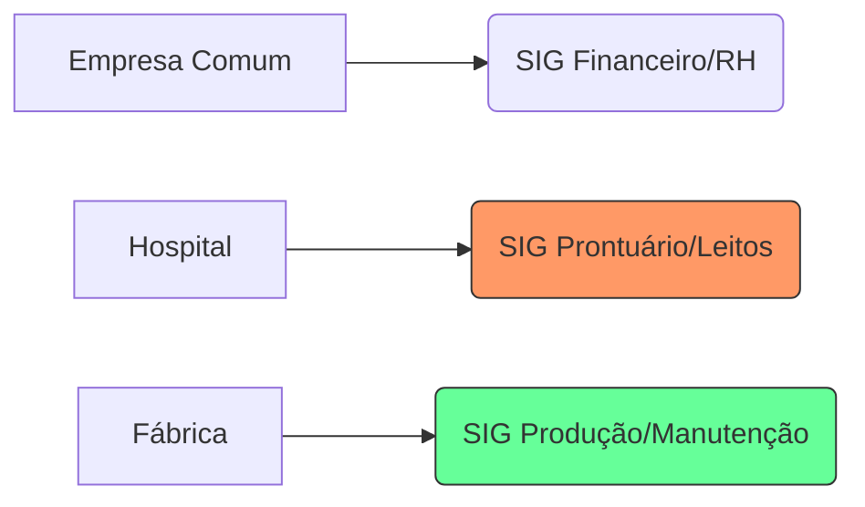

# Aula 07 - SIGs Corporativos e Atividades Específicas 🧪

!!! tip "Objetivo"
    **Objetivo**: Identificar como diferentes setores da economia utilizam SIGs customizados para suas necessidades e entender a diferença entre sistemas genéricos e sistemas verticais (segmentados).

---

## 1. Sistemas Genéricos vs. Sistemas Verticais 🏢

Nem todo SIG serve para qualquer empresa. Dependendo da atividade-fim, o sistema muda completamente.

*   **SIG Genérico**: Atende funções administrativas básicas de qualquer empresa (RH, Contabilidade, Financeiro).
*   **SIG Vertical (Software de Nicho)**: Focado em um setor específico, com regras e fluxos próprios (ex: Sistema para Hospitais, Postos de Combustível ou Escritórios de Advocacia).

---

## 2. Exemplos de SIG por Atividade ⚙️

### 🏥 SIG Hospitalar (HIS)
Foca no prontuário eletrônico do paciente, gestão de leitos e faturamento de convênios.

### 🏭 SIG Industrial (MES)
Controla a produção em tempo real, parada de máquinas e qualidade das peças.

### 🏦 SIG Bancário
Extrema segurança, processamento de milhares de transações por segundo e gestão de riscos financeiros.

### Comparativo de Foco (Mermaid)



---

## 3. Gestão de Informações em Atividades de Risco ⚠️

Em setores como aviação ou energia nuclear, o SIG tem um papel crítico: **evitar desastres**. Nesses casos, o sistema prioriza:
*   Redundância de dados.
*   Alertas imediatos em caso de anomalias.
*   Histórico imutável de logs para auditoria posterior.

---

## 4. Consultando o SIG por Setor no Terminal 🚀

Visualize como um SIG específico retorna dados de nicho:

```termynal
$ sig-industrial --status-maquina 07
[LENDO SENSORES] Temperatura: 85°C | Rotação: 1.200 RPM
[ALERTA] Manutenção preventiva necessária em 48h.
$ sig-hospitalar --leitos-disponiveis --ala "UTI"
UNIDADES TOTAIS: 20
DISPONÍVEIS: 02
AGUARDANDO ALTA: 03
```

---

## 5. Mini-Projeto: Escolha de Sistema 🚀

Imagine que você foi contratado para informatizar um **Escritório de Contabilidade**:

1.  Pesquise (ou use seu conhecimento) o nome de uma função que um SIG específico de contabilidade deveria ter.
2.  Por que um ERP genérico (como o de uma loja) não seria ideal para esse escritório?
    *   *Exemplo*: Função "Importação automática de notas fiscais da prefeitura". O ERP de loja foca em "Venda de balcão".

---

## 6. Exercício de Fixação 🧠

Responda em seu caderno/arquivo de notas:

1.  O que é um software de "nicho" ou vertical?
2.  Dê um exemplo de como o SIG de uma escola difere do SIG de um supermercado.
3.  Qual a importância da integração entre um sistema específico (ex: gestão de leitos) e o sistema financeiro central da empresa?

---

**Próxima Aula**: Vamos explorar a [Comunicação Empresarial e Comercial no Ambiente Digital](./aula-08.md)! 📞