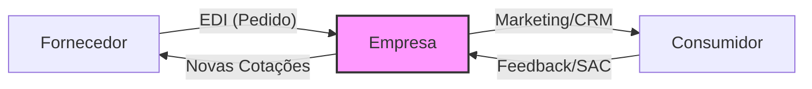

# Aula 08 - Comunicação Empresarial e Comercial 📞

!!! tip "Objetivo"
    **Objetivo**: Entender o papel da tecnologia na integração entre fornecedores, empresa e consumidores, e como as ferramentas de comunicação digital otimizam as relações comerciais.

---

## 1. A Tecnologia como Ponte Comercial 🌉

Antigamente, a comunicação comercial era baseada em papel, telefone e reuniões presenciais. Hoje, vivemos a era da **Integração Digital**, onde a informação flui em tempo real.

*   **B2B (Business to Business)**: Venda de empresa para empresa (ex: Uma fábrica vendendo para um supermercado).
*   **B2C (Business to Consumer)**: Venda da empresa para o consumidor final (ex: Supermercado vendendo para você).
*   **C2C (Consumer to Consumer)**: Consumidores vendendo entre si (ex: OLX, Mercado Livre).

---

## 2. EDI: Troca Eletrônica de Dados 📡

O **EDI** (*Electronic Data Interchange*) é uma tecnologia que permite que o sistema de um fornecedor "converse" diretamente com o sistema da empresa compradora, sem intervenção humana.

### Benefícios do EDI
*   **Eliminação de Papel**: Pedidos e notas fiscais são digitais.
*   **Agilidade**: O pedido entra no sistema do fornecedor segundos após ser gerado.
*   **Redução de Erros**: O dado é lido diretamente pelo computador, sem redigitação.

---

## 3. Gestão de Fornecedores e Consumidores 🤝

Para um administrador, manter a comunicação clara com as duas pontas é vital:

### 🏭 Lado do Fornecedor (Suprimentos)
Uso de portais de compras e sistemas de cotação online para garantir o melhor preço e prazo.

### 👤 Lado do Consumidor (Vendas)
Uso de redes sociais, chatbots e plataformas de atendimento para resolver dúvidas e fechar vendas de forma rápida.

### Fluxo de Comunicação Integrada (Mermaid)



---

## 4. Simulando a Comunicação no Terminal 🚀

Visualize como um sistema moderniza o contato comercial:

<!-- termynal -->
```bash
$ comercial-enviar-pedido --fornecedor "Alimentos_SA" --itens "Farinha:50kg" 
[TRANSFERINDO] Conectando via protocolo EDI...
[DOCUMENTO] XML da Nota Fiscal recebido com sucesso.
[LOGÍSTICA] Entrega agendada para: 15/06 às 08:00.
$ comercial-avisar-clientes --whatsapp "Chegou farinha nova na padaria!"
[STATUS] 500 mensagens enviadas via API.
[CONVERTENDO] 12 clientes clicaram no link de compra.
```

---

## 5. Mini-Projeto: Otimização de Atendimento 🚀

Sua missão é melhorar a comunicação de uma **Loja de Móveis**:

1.  Identifique **1 problema** que ocorre quando a comunicação com o fornecedor é feita apenas por telefone.
2.  Sugira uma ferramenta (ou tipo de sistema) para automatizar o atendimento ao consumidor final que reclama de atraso na entrega.
    *   *Exemplo*: Problema: Preço desatualizado no pedido. Sugestão: Chatbot com rastreio de pedido em tempo real.

---

## 6. Exercício de Fixação 🧠

Responda em seu caderno/arquivo de notas:

1.  Explique o conceito de B2B com um exemplo prático.
2.  Por que o EDI é considerado uma peça fundamental na logística moderna?
3.  Qual a diferença entre um portal de compras e um e-commerce tradicional?

---

## 🔗 Materiais da Aula

<div class="grid cards" markdown>
- :material-presentation: **Slides**

    ---

    Material visual com diagramas e conceitos-chave.

    [:octicons-arrow-right-24: Slide 08](../slides/slide-08.html)

- :material-help-circle: **Quiz**

    ---

    Teste seu conhecimento com 10 questões interativas.

    [:octicons-arrow-right-24: Quiz 08](../quizzes/quiz-08.md)

- :fontawesome-solid-pencil: **Exercícios**

    ---

    5 exercícios progressivos (básico → desafio).

    [:octicons-arrow-right-24: Exercício 08](../exercicios/exercicio-08.md)

- :material-briefcase-outline: **Projeto**

    ---

    Aplicação prática dos conceitos da aula.

    [:octicons-arrow-right-24: Projeto 08](../projetos/projeto-08.md)

</div>

---

[➡️ Próxima Aula: Aula 09](./aula-09.md){ .md-button .md-button--primary }
