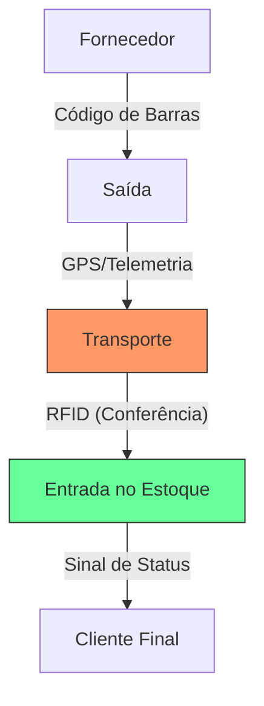

# Aula 09 - Rastreamento Logístico e de Materiais 📦

!!! tip "Objetivo"
    **Objetivo**: Compreender as tecnologias de identificação e rastreamento de produtos, entender o fluxo logístico moderno e como a automação reduz perdas e aumenta a eficiência no estoque.

---

## 1. O Que é Rastreabilidade Logística? 🔍

Rastreabilidade é a capacidade de seguir a história, a aplicação ou a localização de um item por meio de registros documentados. No mundo administrativo, isso evita que produtos "sumam" ou vençam sem uso.

### 🛡️ Por que rastrear?
*   **Recalls**: Identificar lotes com defeito rapidamente.
*   **Segurança**: Evitar furtos e desvios de carga.
*   **Eficiência**: Saber exatamente onde o produto está no galpão.
*   **Gestão de Prazos**: Controlar datas de validade (FIFO/PEPS).

---

## 2. Tecnologias de Identificação 🏷️

Atualmente, existem três grandes formas de identificar e rastrear produtos:

1.  **Código de Barras (1D)**: O mais comum. Barato e fácil, mas requer leitura óptica direta e individual.
2.  **QR Code (2D)**: Armazena muito mais dados que o código de barras (links, manuais, datas).
3.  **RFID (Identificação por Rádio Frequência)**: Etiquetas com microchips que podem ser lidas a distância e em massa (ex: ler todos os itens de uma caixa sem abri-la).

---

## 3. O Fluxo de Rastreamento Moderno 🌊

A mercadoria é monitorada desde a saída do fornecedor até a porta do cliente.

### Etapas do Fluxo (Mermaid)



---

## 4. Simulando o Rastreio no Terminal 🚀

Visualize como um administrador logístico opera o sistema:

```termynal
$ logistica-rastreio --carga "ID-4420"
[LOCALIZANDO] Conectando via GPS ao caminhão Placa ABC-1234...
[DISTÂNCIA] Falta: 120km | Tempo Estimado: 01h 45min
$ logistica-inventario --rfid-scan --setor "Corredor_A"
[LENDO] Escaneando setor via rádio frequência...
[OK] 500 itens identificados.
[ALERTA] 02 itens detectados com data de validade vencida (Lote 99).
$ logistica-notificar-vencimento --lote 99 --acao "Remover"
[OK] Ordem de serviço enviada para o operador de empilhadeira.
```

---

## 5. Mini-Projeto: Escolha de Tecnologia 🚀

Sua missão é atuar como um gestor de almoxarifado:

1.  Imagine um **estoque de joias de luxo** e um **estoque de iogurtes**.
2.  Qual tecnologia de identificação (Código de Barras, QR Code ou RFID) você usaria para cada um?
3.  Justifique sua escolha com base no **valor do produto** ou na **velocidade de giro**.
    *   *Exemplo*: RFID para joias pela segurança e facilidade de inventário rápido. QR Code para iogurtes para o cliente ver receitas ou validade no celular.

---

## 6. Exercício de Fixação 🧠

Responda em seu caderno/arquivo de notas:

1.  Explique a principal vantagem do RFID sobre o código de barras tradicional.
2.  O que é telemetria e como ela ajuda no transporte de cargas?
3.  Como a rastreabilidade ajuda a empresa em caso de devolução de produtos com defeito?

---

**Próxima Aula**: Vamos mergulhar nos [Sistemas de Transações Comerciais](./aula-10.md)! 🛒
