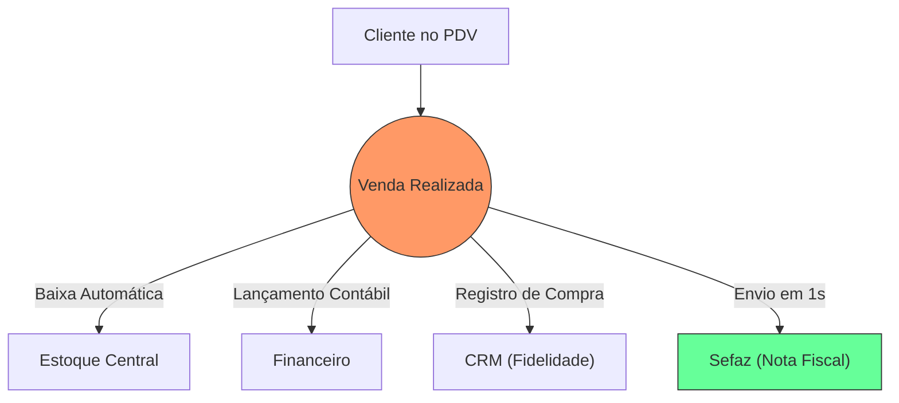

# Aula 10 - Sistemas de Transações Comerciais 🛒

!!! tip "Objetivo"
    **Objetivo**: Entender o funcionamento dos sistemas de automação comercial, a integração do Ponto de Venda (PDV) com o backoffice e a importância da emissão de documentos fiscais eletrônicos.

---

## 1. O Ponto de Venda (PDV) 💵

O **PDV** (*Point of Sale*) é a interface onde a transação comercial com o cliente acontece. Ele é a "ponta" do sistema que lida com dinheiro, produtos e impostos ao mesmo tempo.

### 🌟 O que um PDV moderno faz:
*   **Leitura de Itens**: Identificação via código de barras.
*   **Pagamento Multi-Meios**: Pix, cartão, dinheiro ou carteiras digitais.
*   **Abertura e Fechamento de Caixa**: Controle do saldo físico vs. saldo digital.
*   **Geração de Cupons**: Impressão ou envio digital do comprovante.

---

## 2. Automação Comercial e o Backoffice 🏗️

A mágica do sistema acontece quando o PDV "avisa" o resto da empresa sobre a venda.

### Fluxo de Transação (Mermaid)



---

## 3. Documentos Fiscais Eletrônicos (NF-e/NFC-e) 📄

No Brasil, toda transação comercial deve ser reportada ao governo em tempo real via **XML**.

*   **NF-e**: Nota Fiscal Eletrônica (Geralmente para B2B).
*   **NFC-e**: Nota Fiscal de Consumidor Eletrônica (O "cupom fiscal" do supermercado).
*   **SAT/MFE**: Equipamentos de hardware que garantem a emissão mesmo sem internet.

---

## 4. Simulando a Venda no Terminal 🚀

Visualize o que acontece "por baixo do capô" em cada venda:

<!-- termynal -->
```bash
$ pdv-iniciar-transacao --caixa 02
[OK] Caixa Aberto. Operador: Maria Silva.
$ pdv-registrar-item --sku "10020-A" --qtd 2
ITEM: Chocolate Meio Amargo | VALOR: R$ 15,00
$ pdv-finalizar-pagamento --metodo "PIX"
[SINCRONIZANDO] Aguardando confirmação do banco...
[OK] Recebido! Gerando NFC-e...
[SEFAZ] Protocolo 1352490182 gerado. Venda Autorizada.
[ESTOQUE] -2 unidades de SKU 10020-A.
```

---

## 5. Mini-Projeto: Planejando o Caixa 🚀

Imagine que você vai abrir um **Pet Shop**:

1.  Aponte **3 periféricos** (hardware) que o seu PDV precisará ter.
2.  Descreva **1 problema grave** que ocorreria se o seu PDV não estivesse integrado ao estoque.
    *   *Exemplo*: Periféricos: Leitor de código de barras, impressora térmica e PIN pad (máquina de cartão). Problema: Vender uma ração que não existe mais no estoque físico.

---

## 6. Exercício de Fixação 🧠

Responda em seu caderno/arquivo de notas:

1.  Diferencie PDV de ERP com suas palavras.
2.  Por que a emissão da Nota Fiscal deve ser, idealmente, instantânea?
3.  O que é um fechamento de caixa e para que ele serve gerencialmente?

---

## 🔗 Materiais da Aula

<div class="grid cards" markdown>
- :material-presentation: **Slides**

    ---

    Material visual com diagramas e conceitos-chave.

    [:octicons-arrow-right-24: Slide 10](../slides/slide-10.html)

- :material-help-circle: **Quiz**

    ---

    Teste seu conhecimento com 10 questões interativas.

    [:octicons-arrow-right-24: Quiz 10](../quizzes/quiz-10.md)

- :fontawesome-solid-pencil: **Exercícios**

    ---

    5 exercícios progressivos (básico → desafio).

    [:octicons-arrow-right-24: Exercício 10](../exercicios/exercicio-10.md)

- :material-briefcase-outline: **Projeto**

    ---

    Aplicação prática dos conceitos da aula.

    [:octicons-arrow-right-24: Projeto 10](../projetos/projeto-10.md)

</div>

---

[➡️ Próxima Aula: Aula 11](./aula-11.md){ .md-button .md-button--primary }
