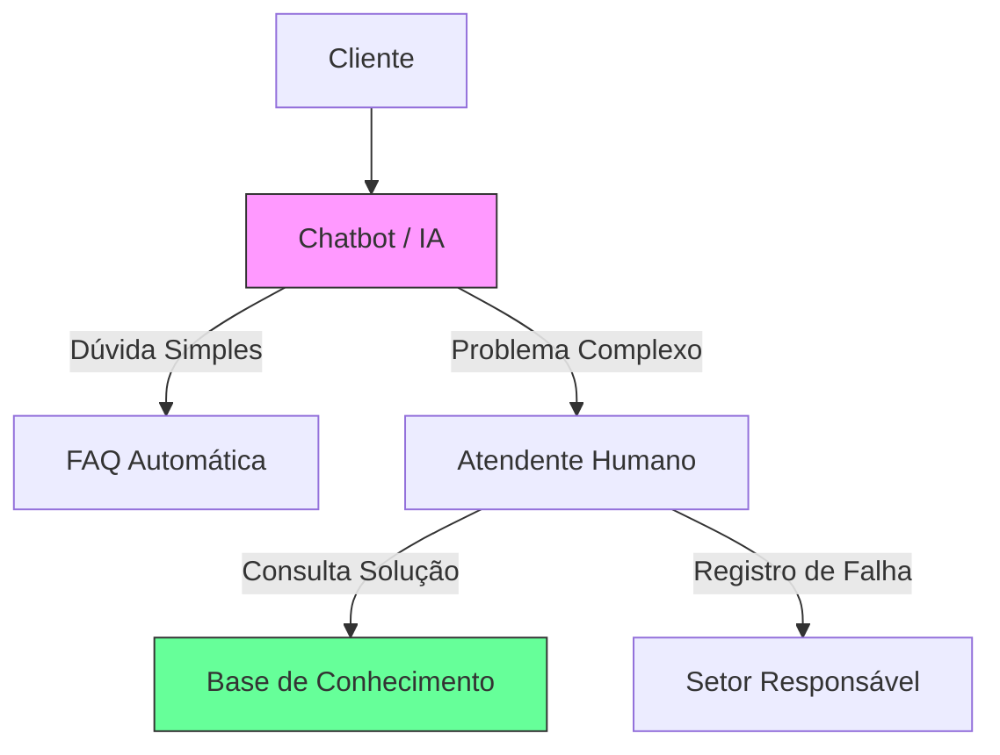

# Aula 11 - Atendimento ao Cliente (SAC e FAQ) 🎧

!!! tip "Objetivo"
    **Objetivo**: Compreender a importância do suporte ao cliente na era digital, aprender como sistemas de SAC e bases de conhecimento (FAQ) reduzem a carga de trabalho e aumentam a satisfação do consumidor.

---

## 1. SAC 4.0: O Atendimento Omnichannel 📱

O **SAC** (*Serviço de Atendimento ao Consumidor*) evoluiu. Não é mais apenas um telefone, mas uma rede integrada de canais onde o cliente escolhe por onde quer falar.

*   **Omnichannel**: Se o cliente começa a reclamação no WhatsApp, ele pode terminar no e-mail sem precisar repetir toda a história. O sistema guarda o contexto.

### Estrutura de Atendimento (Mermaid)



---

## 2. FAQ: A Primeira Linha de Defesa 🛡️

Uma **FAQ** (*Frequently Asked Questions*) bem estruturada pode resolver até 70% das dúvidas dos clientes antes mesmo de eles entrarem em contato.

*   **Self-Service**: O próprio cliente se ajuda.
*   **Redução de Custos**: Menos atendentes humanos necessários para responder "como troco minha senha?".
*   **Melhoria de SEO**: Perguntas e respostas ajudam o seu site a aparecer no Google.

---

## 3. Help Desk e Gestão de Tickets 🎫

Quando o problema requer ação humana, o sistema gera um **Ticket** (Chamado).

*   **SLA (Service Level Agreement)**: O tempo máximo que a empresa tem para responder (ex: "Responderemos em 24h").
*   **Priorização**: O sistema identifica o que é urgente (ex: "Sistema Fora do Ar") vs o que é baixa prioridade.

---

## 4. Simulando o Atendimento no Terminal 🚀

Visualize como o sistema gerencia o fluxo de suporte:

```termynal
$ sac-listar-tickets --status "Aberto" --prioridade "Alta"
[FILTRANDO] 03 chamados encontrados.
[ID-990] Cliente: João | Assunto: "Atraso na Entrega" | Tempo: 05h
$ sac-assumir-ticket --id 990
[OK] Atendente Ricardo assumiu o chamado. Abrindo histórico do CRM...
$ sac-consultar-kb --termo "logistica atraso"
[SUGESTÃO FAQ] "Informar ao cliente sobre greve local. Oferecer cupom 'DESC5'."
$ sac-responder --id 990 --msg "Olá João, pedimos desculpas pelo atraso..." --status "Resolvido"
[OK] Resposta enviada. Feedback solicitado via e-mail.
```

---

## 5. Mini-Projeto: Criando sua FAQ 🚀

Sua missão é atuar como um gestor de suporte de um **Banco Digital**:

1.  Escreva **3 perguntas frequentes (FAQs)** que um banco digital deveria ter.
2.  Crie uma resposta curta e objetiva para cada uma.
3.  Defina qual dessas perguntas poderia ser respondida 100% por um **Chatbot**.
    *   *Exemplo*: Pergunta: "Como bloqueio meu cartão?". Resposta: "Acesse o Menu -> Cartão -> Bloquear". (Chatbot faz isso fácil).

---

## 6. Exercício de Fixação 🧠

Responda em seu caderno/arquivo de notas:

1.  O que significa o termo "Omnichannel" no suporte ao cliente?
2.  Por que uma Base de Conhecimento é importante tanto para o cliente quanto para o atendente?
3.  Explique a importância do SLA para a imagem de uma empresa.

---

**Próxima Aula**: Vamos explorar as ferramentas de [E-mail Corporativo e Comunicação Interna](./aula-12.md)! 📧