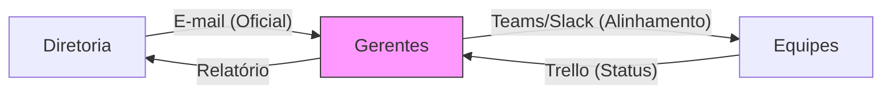

# Aula 12 - E-mail Corporativo e Ferramentas de Comunicação 📧

!!! tip "Objetivo"
    **Objetivo**: Entender a importância da comunicação formal no ambiente empresarial, aprender as boas práticas de uso do e-mail corporativo e conhecer ferramentas modernas de colaboração interna.

---

## 1. O E-mail como Documento Oficial 📑

No mundo dos negócios, o e-mail não é apenas uma mensagem; ele é um **registro documental**. Acordos, aprovações e instruções enviadas por e-mail têm valor administrativo e, muitas vezes, jurídico.

### 🌟 Regras de Ouro do E-mail Corporativo:
*   **Assunto Claro**: Deve resumir o conteúdo (ex: "Aprovação de Orçamento - Projeto X").
*   **Profissionalismo**: Evite gírias, use saudação e assinatura formal.
*   **Gramática e Ortografia**: Revisar sempre antes de enviar.
*   **Cópia (CC e CCO)**: Use CC para manter pessoas informadas e CCO quando precisar ocultar destinatários por privacidade.

---

## 2. Ferramentas de Colaboração (Chat e Projetos) 💬

Além do e-mail, as empresas modernas utilizam ferramentas de comunicação em tempo real e gestão de tarefas.

### 🗨️ Chat Corporativo (Slack / Microsoft Teams)
Focado em conversas rápidas, troca de arquivos e reuniões por vídeo. Reduz o volume de e-mails internos.

### 📋 Gestão de Tarefas (Trello / Jira / Asana)
Sistemas onde o administrador delega funções e acompanha o progresso de cada projeto através de quadros (Kanban).

---

## 3. Fluxo de Comunicação Interna (Mermaid) 🌊

A informação deve circular de forma eficiente entre os colaboradores.



---

## 4. Simulando a Gestão de Comunicação no Terminal 🚀

Visualize como o sistema integra e-mail e tarefas:

```termynal
$ comunicacao-enviar-aviso --setor "Financeiro" --msg "Reunião de metas amanhã às 09h"
[E-MAIL] Enviando para 15 destinatários... [OK]
[SLACK] Postando no canal #financeiro-avisos... [OK]
$ projeto-criar-tarefa --quadro "Expansão" --titulo "Análise de novo ponto"
[TRELLO] Tarefa criada na coluna 'A fazer'.
[NOTIFICAÇÃO] Gestor alertado via e-mail corporativo.
```

---

## 5. Mini-Projeto: Etiqueta no E-mail 🚀

Sua missão é atuar como um gestor de RH:

1.  Um funcionário enviou um e-mail para toda a empresa com o assunto "ALGUÉM ESQUECEU O CARRO ACESO NO ESTACIONAMENTO!!!!!!" (tudo em maiúsculas).
2.  Aponte **2 erros de etiqueta** nesse e-mail.
3.  Reescreva o e-mail de forma profissional.
    *   *Exemplo*: Erros: Títulos em maiúsculas (gritar) e falta de clareza no assunto. Sugestão: "Aviso: Veículo com luzes acesas no estacionamento".

---

## 6. Exercício de Fixação 🧠

Responda em seu caderno/arquivo de notas:

1.  Por que o e-mail corporativo ainda é essencial, mesmo com o uso de chats como Slack?
2.  Explique a diferença entre enviar um e-mail em CC (Cópia Carbono) e CCO (Cópia Carbono Oculta).
3.  Como ferramentas de gestão como o Trello ajudam a evitar a "sobrecarga de e-mails"?

---

**Próxima Aula**: Vamos iniciar o estudo técnico sobre [Entrada de Dados e Processamento](./aula-13.md)! 🗄️
