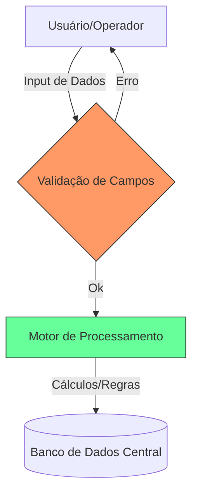

# Aula 13 - Gestão de Banco de Dados: Entrada e Processo 🗄️

!!! tip "Objetivo"
    **Objetivo**: Entender tecnicamente como os dados entram em um sistema de banco de dados corporativo, a importância da validação na entrada e como o processamento transforma dados brutos em registros organizados.

---

## 1. Do Papel ao Banco de Dados 📝

Em um sistema administrativo, o Banco de Dados (BD) é o "cofre" da empresa. Mas para que a informação seja segura, o processo de **Entrada** deve seguir regras rígidas.

### 🌟 O Papel das Máscaras e Regras de Validação:
Para evitar erros, o sistema usa "máscaras" de entrada que obrigam o usuário a seguir um padrão.
*   **CPF**: Impede letras e obriga 11 números.
*   **Data**: Garante que o dia 32/13 não seja aceito.
*   **Campos Obrigatórios**: O sistema não "salva" se faltar o valor do produto.

---

## 2. A Camada de Processamento ⚙️

Após a entrada, os dados passam pelo **Processamento**. É aqui que o sistema faz cálculos e cruza informações.

*   **Cálculo Automático**: Venda de 5 itens a R$ 10,00 -> Processamento gera R$ 50,00.
*   **Conversão de Unidades**: Você compra em "Caixas" e o sistema processa como "Unidades" para o estoque.
*   **Agrupamento**: O sistema junta todas as vendas do dia para gerar o fechamento.

### Fluxo de Entrada e Processo (Mermaid)



---

## 3. Integridade Referencial 🔗

Um banco de dados de administração é **Relacional**. Isso significa que as informações estão ligadas.

!!! info "Exemplo Crítico"
    Você não pode cadastrar uma **Venda** para um **Cliente** que não existe no banco de dados. O sistema processa essa "relação" e impede o erro através de chaves estrangeiras.

---

## 4. Visualizando o Processamento via Terminal 🚀

Visualize como o sistema trata os dados antes de salvá-los:

```termynal
$ bd-processar-venda --cliente "990" --itens "Pão:10:un"
[VALIDANDO] Cliente ID 990 encontrado (Ricardo Silva).
[PROCESSANDO] Calculando preço (Item: Pão | Un: 0.50 | Qtd: 10)
[GERANDO] Total da Venda: R$ 5,00.
[ESTOQUE] Reservando 10 unidades para baixa...
$ bd-status-transacao --hoje
PENDENTES: 0 | PROCESSADAS: 450 | ERROS: 02
```

---

## 5. Mini-Projeto: Desenho de Formulário 🚀

Sua missão é atuar como um designer de sistemas:

1.  Desenhe (descreva) os **5 campos principais** para um formulário de "Cadastro de Produto".
2.  Defina **1 regra de validação** para o campo "Preço de Custo".
3.  Explique o que aconteceria se o sistema permitisse "Preço de Custo" = 0.
    *   *Exemplo: Campo: "Preço de Venda". Regra: Deve ser maior que o Preço de Custo.*

---

## 6. Exercício de Fixação 🧠

Responda em seu caderno/arquivo de notas:

1.  Diferencie Entrada de Dados de Processamento de Dados.
2.  O que é uma "máscara de entrada" e qual sua utilidade prática?
3.  Por que a integridade referencial é vital para um sistema administrativo?

---

**Próxima Aula**: Vamos explorar o resultado final: [Banco de Dados - Saída e Feedback](./aula-14.md)! 📊