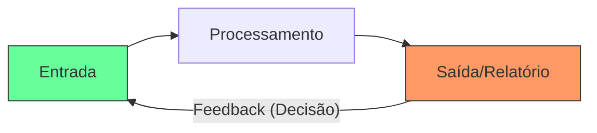

# Aula 14 - Gestão de Banco de Dados: Saída e Feedback 📊

!!! tip "Objetivo"
    **Objetivo**: Compreender como os dados processados retornam ao gestor em forma de saídas úteis, a importância do feedback para a correção de processos e como a visualização de dados facilita a gestão.

---

## 1. O Que são Saídas (Outputs)? 📤

Uma **Saída** é o resultado final do trabalho do sistema. No contexto administrativo, ela deve ser acionável — ou seja, deve fazer o administrador tomar uma atitude.

### 🌟 Tipos de Saídas Comuns:
*   **Relatórios Sintéticos**: Resumos para a diretoria (ex: "Faturamento Total Mensal").
*   **Relatórios Analíticos**: Detalhes para a gerência (ex: "Lista de Vendas por Vendedor").
*   **Documentos Operacionais**: Notas fiscais, boletos, ordens de serviço.
*   **Alertas e Notificações**: Avisos de estoque baixo ou atraso de pagamento.

---

## 2. O Papel do Feedback no Sistema 🔄

O **Feedback** (Retroalimentação) ocorre quando a saída de um processo é usada para ajustar a entrada ou o próprio processamento.

!!! info "Ciclo de Ajuste"
    Se o relatório de saída mostra que o custo de um produto subiu demais, o administrador usa esse **feedback** para renegociar com o fornecedor (ajustando a entrada de dados).

### O Ciclo Completo do Sistema (Mermaid)



---

## 3. Dashboards e Visualização de Dados 📈

Ver uma tabela com 1.000 linhas é difícil. Por isso, os sistemas modernos focam em **Dashboards** (Painéis Visuais).

*   **Gráficos de Pizza**: Ótimos para ver fatias de mercado ou categorias.
*   **Gráficos de Linha**: Perfeitos para ver a evolução das vendas no tempo.
*   **Semáforos (KPIs)**: Verde (Ok), Amarelo (Atenção), Vermelho (Crítico).

---

## 4. Gerando Saídas e Feedback no Terminal 🚀

Visualize como o sistema solicita e entrega informações de saída:

```termynal
$ bd-gerar-saida --tipo "Alerta_Estoque"
[CONSULTANDO] Verificando níveis mínimos...
[SAÍDA] 05 Itens encontrados abaixo do estoque de segurança.
$ bd-aplicar-feedback --item "Laptop_X" --novo-estoque-minimo 50
[OK] Feedback aplicado. O sistema agora avisará mais cedo sobre a falta.
$ bd-dashboard-vendas --periodo "maio_2024"
[GRÁFICO] Vendas Totais: R$ 45.100,00 [=======---] 70% da Meta.
[ALERTA] Melhor Vendedor: Carlos Souza | Pior Categoria: Papelaria.
```

---

## 5. Mini-Projeto: Analista de Saídas 🚀

Sua missão é melhorar os relatórios de uma **Distribuidora de Bebidas**:

1.  O gerente geral diz: *"Eu recebo um papel com todas as vendas do mês, mas demoro 3 dias para saber qual foi o produto mais vendido"*.
2.  Sugira uma **Saída (Relatório)** específica para resolver o problema dele.
3.  Qual **Gráfico** seria ideal para ele visualizar essa informação rapidamente?
    *   *Exemplo*: Relatório: "Ranking de Produtos por Volume de Venda". Gráfico: Gráfico de barras (Top 10).

---

## 6. Exercício de Fixação 🧠

Responda em seu caderno/arquivo de notas:

1.  Diferencie um relatório sintético de um analítico.
2.  Explique com um exemplo prático como o feedback pode salvar uma empresa de um prejuízo.
3.  Por que as notificações de alerta (como um e-mail de "estoque baixo") são consideradas saídas de sistema?

---

**Próxima Aula**: Vamos explorar o mundo do [E-commerce e Marketing Digital](./aula-15.md)! 🛒
