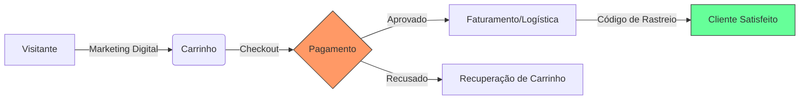

# Aula 15 - E-commerce e Marketing Digital 🛒

!!! tip "Objetivo"
    **Objetivo**: Entender os fundamentos do comércio eletrônico, as principais plataformas de venda online e como o marketing digital aliado à tecnologia impulsiona os resultados das empresas modernas.

---

## 1. O Que é E-commerce? 💻

O **E-commerce** (Comércio Eletrônico) é a compra e venda de produtos ou serviços através da internet. Ele permite que uma empresa venda 24 horas por dia para qualquer lugar do mundo.

### 🌟 Modelos de Venda Online:
*   **Loja Própria**: Site exclusivo da marca (ex: Loja da Nike).
*   **Marketplace**: Grandes "shoppings virtuais" onde várias lojas vendem (ex: Amazon, Mercado Livre, Shopee).
*   **Dropshipping**: Venda sem estoque físico próprio; o fornecedor envia direto para o cliente.

---

## 2. A Jornada de Compra Digital 🛣️

Diferente da loja física, no e-commerce o sistema deve guiar o cliente por cada etapa de forma automática.

### Ciclo do Pedido Online (Mermaid)



---

## 3. Ferramentas de Marketing e Conversão 📈

Para o administrador, não basta ter o site; é preciso atrair pessoas e medir os resultados.

*   **SEO (Search Engine Optimization)**: Técnicas para o site aparecer no topo do Google sem pagar.
*   **Tráfego Pago (Google Ads / Meta Ads)**: Anúncios patrocinados para atrair clientes.
*   **Analytics**: Sistemas que mostram de onde os clientes vêm e o que eles clicam.
*   **E-mail Marketing**: Automação para enviar ofertas personalizadas.

---

## 4. Simulando a Gestão de Loja no Terminal 🚀

Visualize como o sistema apresenta dados de e-commerce e marketing:

```termynal
$ e-commerce-status --vendas-hoje
TOTAL: R$ 12.500,00 | PEDIDOS: 45 | TICKET MÉDIO: R$ 277,00
$ marketing-analisar-campanha --id "BlackFriday_2"
CLIKCS: 12.000 | CONVERSÕES: 300 | CUSTO POR AQUISIÇÃO (CPA): R$ 5,50
[STATUS] Campanha Lucrativa! Sugestão: Aumentar orçamento em 20%.
$ e-commerce-recuperar-carrinhos --abandonados 12
[OK] 12 Cupons de 10% de desconto enviados via e-mail e WhatsApp.
```

---

## 5. Mini-Projeto: Planejando sua Loja 🚀

Sua missão é atuar como consultor de e-commerce para uma **Loja de Doces Caseiros**:

1.  Sugira a melhor plataforma: **Loja Própria** ou **Marketplace** (iFood/Shopee) para começar. Justifique.
2.  Descreva **1 estratégia de marketing digital** para atrair clientes locais.
    *   *Exemplo*: Estratégia: Anúncios no Instagram focados em um raio de 10km da produção.

---

## 6. Exercício de Fixação 🧠

Responda em seu caderno/arquivo de notas:

1.  O que é um Marketplace e qual a sua principal vantagem para quem está começando?
2  Explique o conceito de "Recuperação de Carrinho" e por que isso é vital para o e-commerce.
3.  Como o Marketing Digital se integra aos sistemas de gestão da empresa (ERP/CRM)?

---

**Próxima Aula**: O grande final! [Revisão e Novas Fronteiras da TIAA](./aula-16.md) 🏆