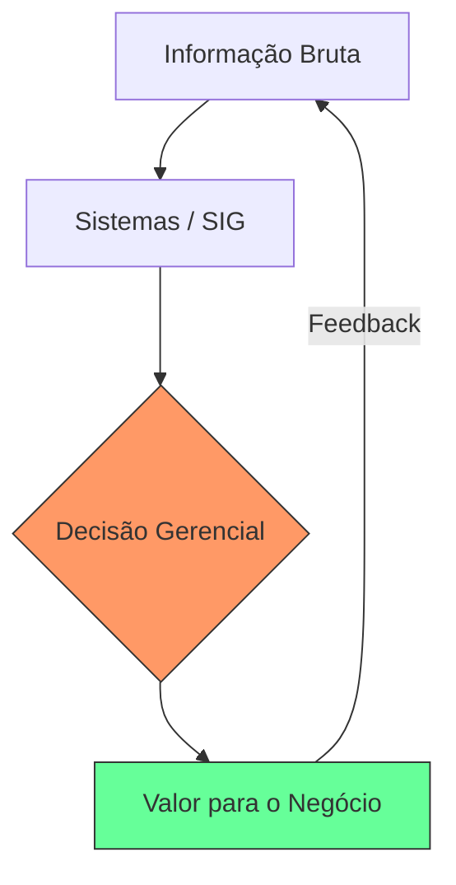

# Aula 16 - Revisão e Novas Fronteiras da TIAA 🚀

!!! tip "Objetivo"
    **Objetivo**: Revisar os principais conceitos de Tecnologia da Informação Aplicada à Administração e explorar as tendências que estão moldando o futuro das empresas, como Inteligência Artificial e Automação Avançada.

---

## 1. O Grande Resumo: A Empresa Integrada 🏗️

Durante este curso, vimos que a TIAA não é sobre "mexer no computador", mas sobre como a **informação** gera valor para o negócio.

*   **ERPs**: Centralizam a operação (Financeiro, RH, Estoque).
*   **SIGs**: Filtram os dados e apoiam a decisão dos gestores.
*   **Comunicações**: Integram fornecedores e clientes em tempo real.
*   **BDs**: Guardam a inteligência da empresa com segurança.

### A Engrenagem da TIAA (Mermaid)



---

## 2. Novas Fronteiras: O Futuro é Agora 🔮

O administrador do futuro (você!) lidará com tecnologias ainda mais potentes:

### 🤖 Inteligência Artificial (IA) no SIG
Os sistemas não apenas "mostram" o que aconteceu, mas "preveem" o que vai acontecer (ex: "Sua venda cairá 10% semana que vem se o estoque não aumentar").

### 🌩️ Cloud Computing Avançado
Acesso total à empresa de qualquer lugar do mundo, com foco em segurança máxima e custo por uso.

### ⛓️ Blockchain na Logística
Rastreamento de mercadorias impossível de ser falsificado, garantindo a ética e a origem dos produtos.

---

## 3. O Próximo Passo na sua Carreira 🏃‍♂️

A TIAA é um campo vasto. Para se destacar, foque em:
1.  **Análise de Dados**: Aprender a ler gráficos e estatísticas.
2.  **Visão Sistêmica**: Entender como cada pequena parte da empresa afeta o todo.
3.  **Atualização Contínua**: A tecnologia muda todo ano; o administrador deve acompanhar.

---

## 4. Simulando a Visão de Futuro no Terminal 🚀

Visualize como uma IA integrada ao SIG opera:

```termynal
$ tiaa-previsao-mensal --setor "Vendas"
[ANALISANDO] Processando dados históricos dos últimos 5 anos...
[INSIGHT] Detectada tendência de alta em 'Produtos Veganos'.
[IA-SUGESTIAO] Aumentar verba de marketing digital em 15% neste nicho.
$ tiaa-vulnerabilidade-scan --status
[LOG] Criptografia Blockchain ativa.
[OK] Integridade de dados de fornecedores: 100% verificada.
```

---

## 5. Mini-Projeto Final: O Administrador Moderno 🚀

Como encerramento, reflita sobre o seu aprendizado:

1.  Escolha uma **empresa real ou fictícia**.
2.  Identifique **1 tecnologia** vista no curso que ela NÃO usa, mas deveria.
3.  Explique como essa tecnologia aumentaria o **lucro** ou reduziria o **custo** dela.
    *   *Exemplo*: Loja de bairro que não usa CRM. Sugestão: Usar CRM para cadastrar clientes e enviar cupons de aniversário, aumentando a fidelidade.

---

## 6. Mensagem de Conclusão 🌟

Parabéns por concluir esta jornada pela **Tecnologia da Informação Aplicada à Administração**! Você agora possui uma visão técnica e estratégica sobre as ferramentas que movem as empresas modernas.

> "A tecnologia é apenas uma ferramenta. O administrador é quem sabe onde e como usá-la para construir o futuro."

---

**FIM DO CURSO** 🎓🚀
Desejamos muito sucesso na sua trajetória profissional!
