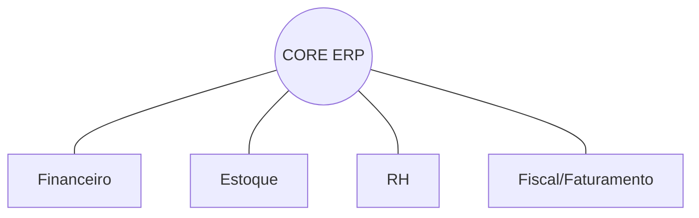

# Aula 03 - Funções e Módulos do ERP ⚙️
## A Engrenagem por Trás da Empresa

---

## Agenda 📅

1. Características de um ERP Profissional <!-- .element: class="fragment" -->
2. A Arquitetura Modular <!-- .element: class="fragment" -->
3. Módulos: Financeiro, Suprimentos e RH <!-- .element: class="fragment" -->
4. Funções Transacionais (O nível operacional) <!-- .element: class="fragment" -->
5. Prática: O Fluxo de uma Compra <!-- .element: class="fragment" -->

---

## 1. Características Técnicas 🏗️

- **Integridade**: Dado correto em todos os lugares. <!-- .element: class="fragment" -->
- **Auditabilidade**: Quem mudou o quê e quando? <!-- .element: class="fragment" -->
- **Segurança**: Perfis de acesso por cargo (RBAC). <!-- .element: class="fragment" -->

---

## 2. A Pirâmide de Módulos 💎



---

## 3. Módulos em Detalhes 📊

### Financeiro
- Contas a pagar/receber e fluxo de caixa. <!-- .element: class="fragment" -->

### Suprimentos (Estoque)
- Entrada de NF e níveis críticos de reposição. <!-- .element: class="fragment" -->

### Recursos Humanos
- Folha de pagamento e capital humano. <!-- .element: class="fragment" -->

---

## 4. O Nível Operacional 🔄

- Funções básicas que movem o dia a dia. <!-- .element: class="fragment" -->
- Conciliação bancária automática. <!-- .element: class="fragment" -->
- Emissão de Nota Fiscal Eletrônica (NF-e). <!-- .element: class="fragment" -->

---

## 5. Prática: Compra Técnica no Terminal 🚀

```termynal
$ pedido-compra --item "Servidor"
[STATUS] Aguardando Aprovação Gerencial...
$ aprovar-pedido --id 450
[OK] Orçamento aprovado.
[FINANCEIRO] Provisão gerada em Contas a Pagar.
[ESTOQUE] Reserva de recebimento criada.
```

---

## Resumo ✅

- O ERP é modular e adaptável. <!-- .element: class="fragment" -->
- A auditabilidade protege contra fraudes e erros. <!-- .element: class="fragment" -->
- A integração entre módulos é o "caminho" da informação. <!-- .element: class="fragment" -->

---

## Próxima Aula: Fundamentos do SIG 📄

- Diferença entre Dado, Informação e Conhecimento. <!-- .element: class="fragment" -->
- Por que o SIG não é apenas um software? <!-- .element: class="fragment" -->

---

## Dúvidas? 🤔

> "A eficiência é fazer certo as coisas; a eficácia é fazer as coisas certas." - Peter Drucker