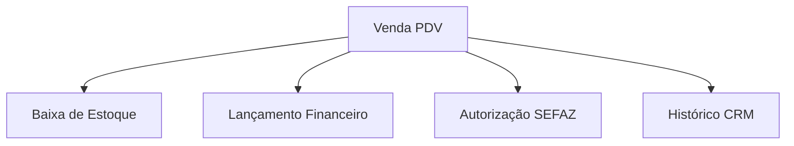

# Aula 10 - Sistemas de Transações Comerciais 🛒
## Do Balcão ao Backoffice: O Fluxo da Venda

---

## Agenda 📅

1. O que é um PDV (Ponto de Venda)? <!-- .element: class="fragment" -->
2. Automação Comercial e Periféricos <!-- .element: class="fragment" -->
3. Documentos Fiscais: NF-e e NFC-e <!-- .element: class="fragment" -->
4. Integração: PDV 🤝 Financeiro/Estoque <!-- .element: class="fragment" -->
5. Simulação de Venda e Fiscal <!-- .element: class="fragment" -->

---

## 1. O Ponto de Venda (PDV) 💵

- Interface de contato direto com o cliente. <!-- .element: class="fragment" -->
- Funções: Registro de itens e recebimento. <!-- .element: class="fragment" -->
- Periféricos: Leitor, Impressora e PinPad. <!-- .element: class="fragment" -->

---

## 2. A Integração é a Chave 🏗️



---

## 3. Fiscal: NFC-e e o XML 📄

- Vendas reportadas em tempo real ao governo. <!-- .element: class="fragment" -->
- **XML**: O documento oficial (não é o papel!). <!-- .element: class="fragment" -->
- **SAT/MFE**: Venda garantida mesmo sem internet. <!-- .element: class="fragment" -->

---

## 4. Prática: Fechando uma Venda 🚀

```termynal
$ pdv-registrar-item --sku "10020-A"
ITEM: Chocolate | VALOR: R$ 15,00.
$ pdv-finalizar-pagamento --metodo "PIX"
[SINCRONIZANDO] Banco confirmou recebimento.
[SEFAZ] NFC-e Autorizada (Protocolo 1352...).
[ESTOQUE] Unidade baixada automaticamente.
```

---

## Resumo ✅

- O PDV move a empresa e os tributos. <!-- .element: class="fragment" -->
- Automação reduz filas e erros de caixa. <!-- .element: class="fragment" -->
- O XML é a prova legal da transação. <!-- .element: class="fragment" -->

---

## Próxima Aula: SAC e Suporte 🎧

- Atendimento Omnichannel e FAQs. <!-- .element: class="fragment" -->
- Como resolver problemas sem humanos (Self-Service). <!-- .element: class="fragment" -->

---

## Dúvidas? 🤔

> "Uma venda não termina quando o cliente paga, mas quando ele volta."