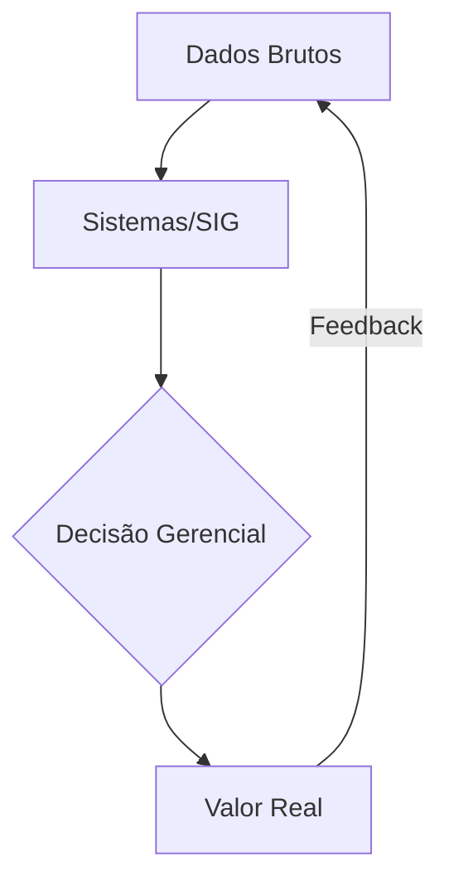

# Aula 16 - Revisão e Futuro da TIAA 🚀
## Rumo à Administração Inteligente

---

## Agenda 📅

1. O Grande Resumo: ERP, SIG e BD <!-- .element: class="fragment" -->
2. Novas Fronteiras: IA e Blockchain <!-- .element: class="fragment" -->
3. Cloud Computing Avançado <!-- .element: class="fragment" -->
4. O Administrador do Futuro (Suas Skills) <!-- .element: class="fragment" -->
5. Visão de Futuro no Terminal <!-- .element: class="fragment" -->

---

## 1. A Engrenagem Integrada 🏗️



- TI não é suporte; é **ESTRATÉGIA**. <!-- .element: class="fragment" -->

---

## 2. O Horizonte Tecnológico 🔮

### Inteligência Artificial (IA)
- Previsão de demanda e automação de decisões. <!-- .element: class="fragment" -->

### Blockchain
- Rastreabilidade inquebrável e ética. <!-- .element: class="fragment" -->

---

## 3. Habilidades do Novo Administrador 🏆

1. **Alfabetização de Dados**: Saber ler o que o SIG diz. <!-- .element: class="fragment" -->
2. **Visão Sistêmica**: Ver a empresa como um organismo vivo. <!-- .element: class="fragment" -->
3. **Segurança Digital**: Liderar a proteção dos dados. <!-- .element: class="fragment" -->

---

## 4. Prática: O SIG do Futuro 🚀

```termynal
$ tiaa-previsao-mensal --setor "Vendas"
[IA] Detectada alta em 'Produtos Veganos'.
[SUGESTÃO] Aumentar estoque e marketing local.
$ tiaa-vulnerabilidade-scan --status
[LOG] Criptografia de ponta a ponta: ATIVA.
[OK] Segurança 100% verificada.
```

---

## Resumo Final ✅

- A informação é o combustível do lucro. <!-- .element: class="fragment" -->
- Sistemas integrados eliminam o "achismo" gerencial. <!-- .element: class="fragment" -->
- Você está pronto para liderar a transformação digital! <!-- .element: class="fragment" -->

---

## Fim do Curso! 🎓🚀

Exclente jornada! Desejamos muito sucesso na sua carreira como administrador moderno e tecnológico.

---

## Dúvidas Finais? 🤔

> "A melhor maneira de prever o futuro é criá-lo." - Peter Drucker