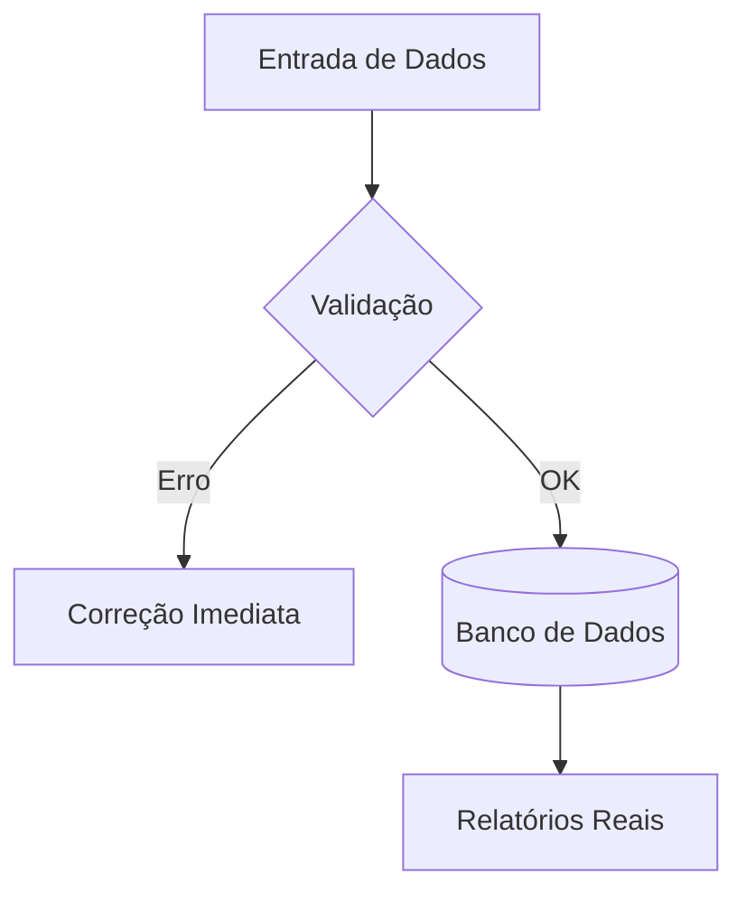

# Aula 05 - SIG e Tomada de Decisão 🧠
## Transformando Incerteza em Estratégia

---

## Agenda 📅

1. O Processo de Decisão no SIG <!-- .element: class="fragment" -->
2. Níveis de Decisão: Estratégico ao Operacional <!-- .element: class="fragment" -->
3. A Regra do GIGO (*Garbage In, Garbage Out*) <!-- .element: class="fragment" -->
4. Qualidade de Dados: Precisão e Pontualidade <!-- .element: class="fragment" -->
5. Simulação de Decisão em Tempo Real <!-- .element: class="fragment" -->

---

## 1. As Fases da Decisão 📝

1. **Inteligência**: Identificar o problema. <!-- .element: class="fragment" -->
2. **Design**: Criar alternativas. <!-- .element: class="fragment" -->
3. **Escolha**: Selecionar a melhor opção baseada em dados. <!-- .element: class="fragment" -->
4. **Implementação**: Colocar o plano em ação. <!-- .element: class="fragment" -->

---

## 2. O SIG em Cada Nível Hierárquico 🏗️

| Nível | Decisão | SIG Foca em... |
| :--- | :--- | :--- |
| **Estratégico** | Longo Prazo | Visão de Mercado / Futuro |
| **Tático** | Médio Prazo | Metas e Departamentos |
| **Operacional** | Curto Prazo | Rotinas e Transações |

---

## 3. Qualidade: O Coração do SIG 🌟

- **Precisão**: O valor deve ser real. <!-- .element: class="fragment" -->
- **Pontualidade**: Dado inserido "na hora". <!-- .element: class="fragment" -->
- **Completude**: Sem campos vazios. <!-- .element: class="fragment" -->

---

## Fluxo de Validação de Dados



---

## 4. Prática: Decidindo no Terminal 💻

```termynal
$ sig-checar-produtividade --frente-loja
[ALERTA] Espera nas filas: 8 minutos.
$ decidir-acao --alternativas "Abrir PDV, Chamar Supervisor"
[SUGESTÃO] Abrir PDV 04 (Funcionários disponíveis detectados).
$ executar-decisao --abrir-pdv 04
[OK] Fila Reduzida. Tempo atual: 3 minutos.
```

---

## Resumo ✅

- Decidir com dados reduz o risco. <!-- .element: class="fragment" -->
- Diferentes níveis pedem diferentes informações. <!-- .element: class="fragment" -->
- Cadastro errado = Decisão errada (*GIGO*). <!-- .element: class="fragment" -->

---

## Próxima Aula: Ciclo da Informação 💾

- Como a informação "viaja" na empresa? <!-- .element: class="fragment" -->
- Gestão de documentos e fluxos digitais. <!-- .element: class="fragment" -->

---

## Dúvidas? 🤔

> "Quem tem a informação, tem o poder. Quem sabe usá-la, tem a estratégia."
