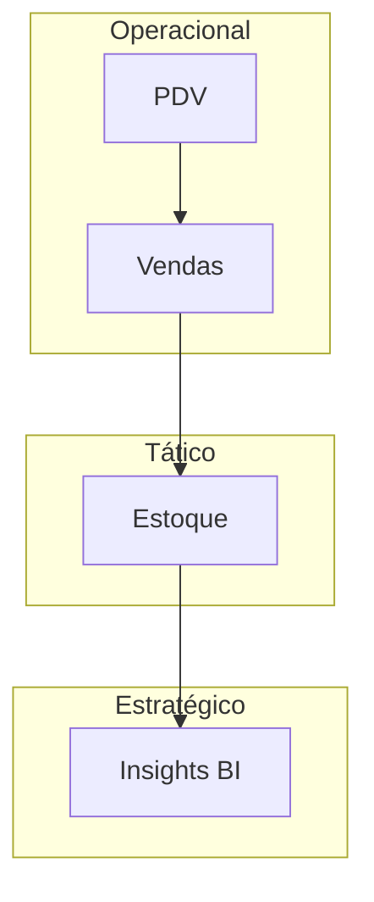

# Aula 06 - Ciclo de Vida e Fluxo da Informação 💾
## A Rodovia de Dados da Empresa

---

## Agenda 📅

1. O Ciclo de Vida da Informação <!-- .element: class="fragment" -->
2. Fluxos Corporativos: Vertical e Horizontal <!-- .element: class="fragment" -->
3. Gestão de Documentos Digitais <!-- .element: class="fragment" -->
4. Backup e Segurança dos Dados <!-- .element: class="fragment" -->
5. Auditoria de Fluxos no Terminal <!-- .element: class="fragment" -->

---

## 1. O Ciclo de Vida 🔄

1. **Coleta**: O nascimento do dado (Cadastro). <!-- .element: class="fragment" -->
2. **Armazenamento**: Proteção no banco de dados. <!-- .element: class="fragment" -->
3. **Processamento**: Transformação em algo útil. <!-- .element: class="fragment" -->
4. **Disseminação**: Entrega ao responsável. <!-- .element: class="fragment" -->
5. **Utilização**: O valor real da decisão. <!-- .element: class="fragment" -->

---

## 2. Fluxos Corporativos 🌊

### Fluxo Vertical
- Direção ↔️ Gerência ↔️ Operacional. <!-- .element: class="fragment" -->

### Fluxo Horizontal
- Vendas 🤝 Estoque 🤝 Financeiro. <!-- .element: class="fragment" -->

---

## Mapa do Fluxo de Informação



---

## 3. Gestão de Documentos Digitais 📂

- **Indexação**: Busca rápida por tags. <!-- .element: class="fragment" -->
- **Versionamento**: Controle de edições (Contratos). <!-- .element: class="fragment" -->
- **Backup**: Recuperação em caso de falhas. <!-- .element: class="fragment" -->

---

## 4. Prática: Monitorando o Fluxo 🚀

```termynal
$ sig-mover-dados --origem "Local" --destino "Nuvem"
[TRANSFERINDO] 1.500 registros detectados.
[VALIDANDO] Integridade 100%.
$ sig-gerar-relatorio --consolidado
[OK] Relatório PDF gerado.
[NOTIFICANDO] E-mail enviado para o Financeiro.
```

---

## Resumo ✅

- A informação deve fluir sem "gargalos". <!-- .element: class="fragment" -->
- Fluxo horizontal integra, fluxo vertical controla. <!-- .element: class="fragment" -->
- Gestão documental organiza o caos digital. <!-- .element: class="fragment" -->

---

## Próxima Aula: SIGs de Nicho 🧪

- Por que um Posto usa um sistema diferente de um Hospital? <!-- .element: class="fragment" -->
- Sistemas Verticais e Redundância. <!-- .element: class="fragment" -->

---

## Dúvidas? 🤔

> "A informação é como a água; precisa fluir para não estagnar o negócio."
