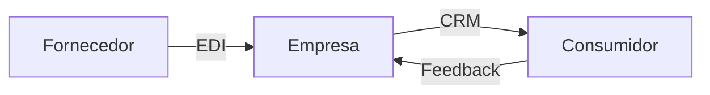

# Aula 08 - Comunicação Empresarial Digital 📞
## Fornecedores, Empresas e Consumidores Conectados

---

## Agenda 📅

1. Modelos de Mercado: B2B, B2C e C2C <!-- .element: class="fragment" -->
2. EDI: Sistemas Conversando com Sistemas <!-- .element: class="fragment" -->
3. Gestão Integrada de Fornecedores <!-- .element: class="fragment" -->
4. Chatbots e CRM na Comunicação com Cliente <!-- .element: class="fragment" -->
5. Automação Logística na Prática <!-- .element: class="fragment" -->

---

## 1. Modelos de Negócio 🌉

- **B2B** (*Business to Business*): Fábrica vende para Loja. <!-- .element: class="fragment" -->
- **B2C** (*Business to Consumer*): Loja vende para Você. <!-- .element: class="fragment" -->
- **C2C** (*Consumer to Consumer*): Você vende para Vizinho (OLX). <!-- .element: class="fragment" -->

---

## 2. Tecnologia EDI: O Fim do Papel 📡

- *Electronic Data Interchange*. <!-- .element: class="fragment" -->
- Pedido enviado via sistema, recebido via sistema. <!-- .element: class="fragment" -->
- **Zeros Erros de Digitação**: O PC lê direto o dado do outro PC. <!-- .element: class="fragment" -->

---

## Fluxo de Comunicação Integrada



---

## 3. Gestão de Consumidores (CRM) 🤝

- Chatbots: Atendimento 24h por dia. <!-- .element: class="fragment" -->
- WhatsApp API: Aumentando a conversão de vendas. <!-- .element: class="fragment" -->
- Histórico de feedbacks para ajustes de produto. <!-- .element: class="fragment" -->

---

## 4. Prática: Enviando Pedido EDI 🚀

```termynal
$ comercial-enviar-pedido --fornecedor "Alimentos_SA"
[TRANSFERINDO] Conectando via EDI...
[OK] XML da Nota Fiscal recebido.
$ comercial-avisar-clientes --whats "Chegou estoque!"
[STATUS] 500 mensagens enviadas automaticamente.
[METRICA] 12 vendas geradas em 5 minutos.
```

---

## Resumo ✅

- O mercado hoje é 100% integrado digitalmente. <!-- .element: class="fragment" -->
- EDI traz velocidade e precisão no B2B. <!-- .element: class="fragment" -->
- O consumidor moderno exige respostas em tempo real. <!-- .element: class="fragment" -->

---

## Próxima Aula: Rastreamento Logístico 📦

- Como o sistema sabe onde está seu pacote? <!-- .element: class="fragment" -->
- Código de Barras, QR Code e RFID. <!-- .element: class="fragment" -->

---

## Dúvidas? 🤔

> "No futuro, as empresas que não se comunicarem via dados, deixarão de existir."