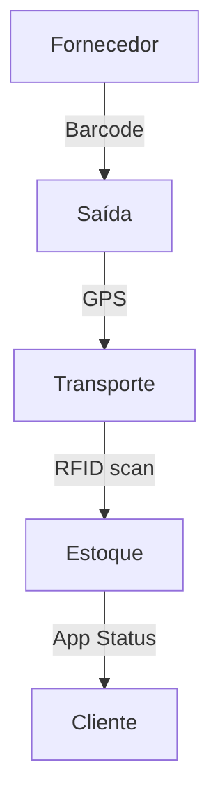

# Aula 09 - Rastreamento Logístico e de Materiais 📦
## O Caminho da Eficiência: Do Fornecedor ao Cliente

---

## Agenda 📅

1. O Que é Rastreabilidade? <!-- .element: class="fragment" -->
2. Tecnologias de ID: Código de Barras, QR e RFID <!-- .element: class="fragment" -->
3. O Fluxo Logístico Moderno <!-- .element: class="fragment" -->
4. Telemetria e GPS no Transporte <!-- .element: class="fragment" -->
5. Operando o Inventário Digital <!-- .element: class="fragment" -->

---

## 1. Por que rastrear? 🔍

- **Recalls**: Segurança e saúde pública. <!-- .element: class="fragment" -->
- **Combate a Furtos**: Localização em tempo real. <!-- .element: class="fragment" -->
- **Gestão FIFO/PEPS**: O que chega primeiro, sai primeiro. <!-- .element: class="fragment" -->

---

## 2. Tecnologias de Identificação 🏷️

- **Código de Barras**: Óptico e individual. <!-- .element: class="fragment" -->
- **QR Code**: Armazena links e dados densos. <!-- .element: class="fragment" -->
- **RFID**: Rádio frequência e leitura em massa. <!-- .element: class="fragment" -->

---

## Fluxo de Rastreamento Moderno



---

## 3. Telemetria no Transporte 🚛

- Monitoramento de temperatura, velocidade e rota. <!-- .element: class="fragment" -->
- Redução de custos com combustível e manutenção. <!-- .element: class="fragment" -->

---

## 4. Prática: Inventário RFID no Terminal 💻

```termynal
$ logistica-inventario --rfid-scan
[ESCANEANDO] Identificando todos os itens do setor...
[OK] 500 itens identificados em 2 segundos.
[ALERTA] 02 itens com validade vencida (Lote 99).
$ logistica-notificar --acao "Remover Lote 99"
[OK] Ordem de serviço enviada ao almoxarifado.
```

---

## Resumo ✅

- Rastrear é garantir a história do produto. <!-- .element: class="fragment" -->
- RFID revoluciona a velocidade do estoque. <!-- .element: class="fragment" -->
- Telemetria traz segurança e economia. <!-- .element: class="fragment" -->

---

## Próxima Aula: Transações Comerciais 🛒

- O Ponto de Venda (PDV) e o Fiscal. <!-- .element: class="fragment" -->
- NF-e e a integração com o governo. <!-- .element: class="fragment" -->

---

## Dúvidas? 🤔

> "Logística é a arte de ter o item certo, no lugar certo, na hora certa."
