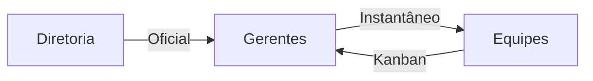

# Aula 12 - E-mail e Comunicação Interna 📧
## Etiqueta, Formalidade e Colaboração

---

## Agenda 📅

1. O E-mail como Documento Oficial <!-- .element: class="fragment" -->
2. Etiqueta Digital e Boas Práticas <!-- .element: class="fragment" -->
3. Chat Corporativo vs. E-mail <!-- .element: class="fragment" -->
4. Gestão de Tarefas (Kanban e Projetos) <!-- .element: class="fragment" -->
5. Integrando o Fluxo Interno <!-- .element: class="fragment" -->

---

## 1. O Valor do E-mail Corporativo 📑

- **Prova Legal**: Acordos registrados via e-mail. <!-- .element: class="fragment" -->
- **Memória Institucional**: Histórico de decisões. <!-- .element: class="fragment" -->
- **Formalidade**: Ideal para o contato com externos. <!-- .element: class="fragment" -->

---

## 2. Dicas de Etiqueta 🌟

- **Assunto Objetivo**: Resuma o conteúdo. <!-- .element: class="fragment" -->
- **Sem Gritar**: Evite CAIXA ALTA. <!-- .element: class="fragment" -->
- **Assinatura Profissional**: Identifique-se. <!-- .element: class="fragment" -->

---

## Fluxo de Informação Interna



---

## 3. Ferramentas de Gestão (Trello/Teams) 📋

- Substituem o "ping-pong" de e-mails. <!-- .element: class="fragment" -->
- Divisão clara de quem faz o quê e quando. <!-- .element: class="fragment" -->
- Fim da "Reunião que poderia ser um e-mail". <!-- .element: class="fragment" -->

---

## 4. Prática: Gestão no Terminal 💻

```termynal
$ comunicacao-enviar-aviso --setor "Financeiro"
[ENVIANDO] E-mail oficial para 15 pessoas.
[AVISO] Postado no canal do Slack #aviso-gerencia.
$ projeto-criar-tarefa --titulo "Auditoria 2024"
[TRELLO] Tarefa criada na coluna 'A fazer'.
[NOTIFICAÇÃO] Responsáveis alertados por e-mail.
```

---

## Resumo ✅

- E-mail é para formalizar; Chat é para agilizar. <!-- .element: class="fragment" -->
- Etiqueta digital evita conflitos desnecessários. <!-- .element: class="fragment" -->
- Gestão de tarefas traz transparência ao trabalho. <!-- .element: class="fragment" -->

---

## Módulo 4: Gestão de Dados 🗄️

- Banco de Dados: Entrada e Processamento. <!-- .element: class="fragment" -->
- E-commerce, Segurança e Marketing Digital. <!-- .element: class="fragment" -->

---

## Dúvidas? 🤔

> "Uma comunicação falha é a raiz de quase todos os problemas administrativos."