# Aula 14 - Gestão de BD: Saída e Feedback 📊
## Do Dado Processado à Decisão Acionável

---

## Agenda 📅

1. O que são Saídas (Outputs)? <!-- .element: class="fragment" -->
2. Relatórios Sintéticos vs. Analíticos <!-- .element: class="fragment" -->
3. Feedback: O Ciclo de Retroalimentação <!-- .element: class="fragment" -->
4. Dashboards: Visualização e KPIs <!-- .element: class="fragment" -->
5. Gerando Insights no Terminal <!-- .element: class="fragment" -->

---

## 1. Tipos de Saída 📤

- **Sintéticos**: Visão macro para Diretores. <!-- .element: class="fragment" -->
- **Analíticos**: Visão detalhada para Supervisores. <!-- .element: class="fragment" -->
- **Operacionais**: Boletos e Notas Fiscais. <!-- .element: class="fragment" -->

---

## 2. O Ciclo do Feedback 🔄

```mermaid
graph LR
    I[Entrada] --> P[Processo]
    P --> O[Saída]
    O -- "Feedback" --> I
```

- A saída corrige a futura entrada. <!-- .element: class="fragment" -->
- Ex: Vendas baixas (Saída) gera nova promoção (Entrada). <!-- .element: class="fragment" -->



---

## 3. Dashboards e Semáforos 📈

- **KPIs**: Indicadores de Sucesso. <!-- .element: class="fragment" -->
- **Verde**: Meta batida. <!-- .element: class="fragment" -->
- **Amarelo**: Alerta. <!-- .element: class="fragment" -->
- **Vermelho**: Ação Imediata necessária. <!-- .element: class="fragment" -->

---

## 4. Prática: Dashboards e Alertas 🚀

```termynal
$ bd-gerar-saida --tipo "Alerta_Estoque"
[ALERTA] 05 itens críticos abaixo do mínimo.
$ bd-dashboard-vendas --periodo "maio_2024"
META: R$ 50.000 | ATUAL: R$ 45.100 (90%)
KPI: Carlos Souza eleito Melhor Vendedor.
$ bd-aplicar-feedback --ajustar-estoque-minimo "Laptop_X"
[OK] Níveis de alerta atualizados para evitar faltas.
```

---

## Resumo ✅

- Saídas devem gerar ação administrativa. <!-- .element: class="fragment" -->
- Dashboards facilitam a "leitura" da empresa. <!-- .element: class="fragment" -->
- Feedback é a chave para o ajuste de rota. <!-- .element: class="fragment" -->

---

## Próxima Aula: E-commerce e Marketing 🛒

- Vendendo 24h por dia na internet. <!-- .element: class="fragment" -->
- Como atrair e converter clientes digitais. <!-- .element: class="fragment" -->

---

## Dúvidas? 🤔

> "O que não pode ser medido, não pode ser gerenciado." - W. Edwards Deming
