# Aula 15 - E-commerce e Marketing Digital 🛒
## O Varejo Global e a Atração de Dados

---

## Agenda 📅

1. Modelos de E-commerce: Próprio, Marketplace e Dropshipping <!-- .element: class="fragment" -->
2. A Jornada de Compra Digital <!-- .element: class="fragment" -->
3. SEO e Tráfego Pago <!-- .element: class="fragment" -->
4. Recuperação de Carrinho e Conversão <!-- .element: class="fragment" -->
5. Status da Loja Virtual no Terminal <!-- .element: class="fragment" -->

---

## 1. Onde vender online? 💻

- **Loja Própria**: Marca exclusiva. <!-- .element: class="fragment" -->
- **Marketplace**: Shopping virtual (Mercado Livre/Amazon). <!-- .element: class="fragment" -->
- **Dropshipping**: Venda sem estoque físico. <!-- .element: class="fragment" -->

---

## 2. A Jornada do Cliente Digital

```mermaid
graph LR
    M[Marketing] --> C(Carrinho)
    C --> P{Checkout}
    P -- "Ok" --> L[Logistica]
    P -- "Falha" --> R[Recuperação]
```



---

## 3. Marketing Orientado a Dados 📈

- **SEO**: Estar no topo do Google de graça. <!-- .element: class="fragment" -->
- **Analytics**: Saber quem clica e onde sai. <!-- .element: class="fragment" -->
- **CPA**: Custo por Aquisição de Cliente. <!-- .element: class="fragment" -->

---

## 4. Prática: Gestão de Loja Online 🚀

```termynal
$ e-commerce-status --vendas-hoje
TOTAL: R$ 12.500 | TICKET MÉDIO: R$ 277.
$ marketing-analisar-campanha --id "Black_Friday"
CLICKs: 12.000 | CONVERSÃO: 3% (Lucrativo).
$ e-commerce-recuperar-carrinhos
[STATUS] 12 Cupons de 10% enviados automaticamente.
```

---

## Resumo ✅

- E-commerce é uma operação 24/7. <!-- .element: class="fragment" -->
- Marketplaces trazem visibilidade imediata. <!-- .element: class="fragment" -->
- Marketing digital e gestão devem estar integrados. <!-- .element: class="fragment" -->

---

## Aula Final: Revisão e Futuro 🚀

- Onde a TIAA vai chegar? <!-- .element: class="fragment" -->
- IA, Blockchain e sua carreira. <!-- .element: class="fragment" -->

---

## Dúvidas? 🤔

> "No e-commerce, a vitrine é infinita e o cliente está a um clique de distância."
