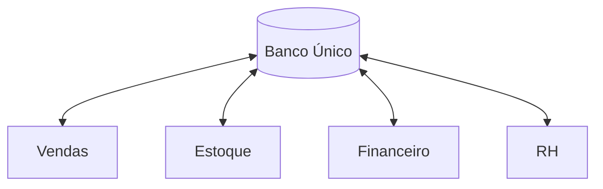

# Aula 01 - Introdução aos Sistemas de Gerenciamento 🏢
## A Evolução da Gestão e o DNA do ERP

---

## Agenda de Hoje 📅

1. O que são Sistemas de Gerenciamento? <!-- .element: class="fragment" -->
2. A Evolução: MRP -> MRP II -> ERP <!-- .element: class="fragment" -->
3. O DNA do ERP (Integração e Banco Único) <!-- .element: class="fragment" -->
4. Complementares: CRM, BI e SCM <!-- .element: class="fragment" -->
5. O Impacto da TI na Estratégia <!-- .element: class="fragment" -->
6. Prática: O Fluxo Integrado <!-- .element: class="fragment" -->

---

## 1. O que é um Sistema de Gerenciamento? 🧩

- Software para coletar, processar e distribuir dados. <!-- .element: class="fragment" -->
- Objetivo: Fazer a empresa "falar o mesmo idioma". <!-- .element: class="fragment" -->
- Unificação de Vendas, Estoque e Financeiro. <!-- .element: class="fragment" -->

---

## 2. A Evolução da Tecnologia na Gestão 🏛️➡️📲

---

## 2.1 Década de 70: MRP 📦

- *Materials Requirement Planning*. <!-- .element: class="fragment" -->
- Foco: **Controle de Estoque** e Produção. <!-- .element: class="fragment" -->
- Gestão de "caixas e peças". <!-- .element: class="fragment" -->

---

## 2.2 Década de 80: MRP II 🏗️

- *Manufacturing Resource Planning*. <!-- .element: class="fragment" -->
- Expandiu para o **Financeiro** e Planejamento. <!-- .element: class="fragment" -->
- Início da integração entre fábrica e escritório. <!-- .element: class="fragment" -->

---

## 2.3 De 90 ao Futuro: ERP 🌐

- *Enterprise Resource Planning*. <!-- .element: class="fragment" -->
- Integração **Total** e em tempo real. <!-- .element: class="fragment" -->
- Um único banco de dados para a holding inteira. <!-- .element: class="fragment" -->

---

## 3. As Características do ERP 🏗️

- **Integração Automática**: Venda baixando estoque "na hora". <!-- .element: class="fragment" -->
- **Banco de Dados Único**: Fim da informação fragmentada. <!-- .element: class="fragment" -->
- **Modularidade**: A empresa cresce e adiciona novos "módulos". <!-- .element: class="fragment" -->

---

## Visualizando a Integração Erp



---

## 4. Tecnologias Complementares ⚖️

| Sigla | Foco Principal |
| :--- | :--- |
| **CRM** | Gestão de Clientes e Vendas |
| **BI** | Inteligência e Tomada de Decisão |
| **SCM** | Cadeia de Suprimentos |

---

## 5. TI: De Suporte a Estratégia 🚀

- Antigamente: TI servia para "consertar impressora". <!-- .element: class="fragment" -->
- Hoje: TI é o **coração** do negócio. <!-- .element: class="fragment" -->
- Visão em tempo real da "saúde" da empresa. <!-- .element: class="fragment" -->

---

## 6. Prática de Gestão no Terminal 💻

```termynal
$ iniciar-venda --cliente "João Silva"
[OK] Verificando estoque... Disponível
[OK] Processando pagamento... NFe Gerada
$ status-gerencial --hoje
Relatório: 1 venda | Estoque atualizado | Caixa: +R$ 4.500
```

---

## Resumo da Aula ✅

- Sistemas de gestão unificam a organização. <!-- .element: class="fragment" -->
- ERP é a evolução máxima da integração. <!-- .element: class="fragment" -->
- Dados integrados = Decisões mais rápidas. <!-- .element: class="fragment" -->

---

## Próxima Aula: CRM e BI 📈

- Como entender o comportamento do cliente? <!-- .element: class="fragment" -->
- Transformando mar de dados em Dashboards. <!-- .element: class="fragment" -->

---

## Dúvidas? 🤔

> "A Tecnologia da Informação e o negócio estão se tornando indissociáveis." - Bill Gates
