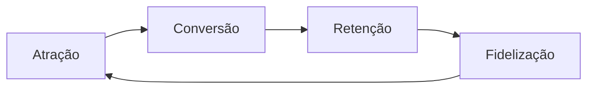

# Aula 02 - CRM, BI e a Sinergia da Gestão 📈
## Relacionamento e Inteligência Competitiva

---

## Agenda 📅

1. O que é CRM? <!-- .element: class="fragment" -->
2. O Ciclo de Vida do Cliente <!-- .element: class="fragment" -->
3. Business Intelligence (BI): Dashboards e KPIs <!-- .element: class="fragment" -->
4. A Sinergia: ERP + CRM + BI <!-- .element: class="fragment" -->
5. Inteligência de Dados na Prática <!-- .element: class="fragment" -->

---

## 1. CRM: Além de um Software 🤝

- *Customer Relationship Management*. <!-- .element: class="fragment" -->
- É uma **estratégia** de foco no cliente. <!-- .element: class="fragment" -->
- Gestão do funil de vendas e fidelização. <!-- .element: class="fragment" -->

---

## O Ciclo do Cliente (Funil)



---

## 2. Business Intelligence (BI) 🧠

- Coleta e análise para **suporte à decisão**. <!-- .element: class="fragment" -->
- Componentes: Data Warehouse e Dashboards. <!-- .element: class="fragment" -->
- Foco em **KPIs** (Indicadores de Desempenho). <!-- .element: class="fragment" -->

---

## 3. ERP vs CRM vs BI 🔗

| Ferramenta | Pergunta que Responde |
| :--- | :--- |
| **ERP** | "Quanto temos no estoque?" |
| **CRM** | "Quem são os clientes fiéis?" |
| **BI** | "Qual será a demanda futura?" |

---

## 4. O Painel do Gestor (BI) 📊

- Visualização clara de metas vs. realidade. <!-- .element: class="fragment" -->
- Alertas de perigo (ex: queda repentina de vendas). <!-- .element: class="fragment" -->

---

## 5. Prática: Dashboard no Terminal 💻

```termynal
$ dashboard-comercial --resumo
[CARREGANDO] Sincronizando ERP e CRM...
TOTAL VENDAS: R$ 125.000,00 (+12%)
CONVERSÃO: 8%
$ gerar-insight --bi
INSIGHT: Clientes do Sul compram mais às terças.
SUGESTÃO: Campanha E-mail via CRM na segunda à noite.
```

---

## Resumo ✅

- CRM foca no relacionamento e vendas. <!-- .element: class="fragment" -->
- BI transforma dados do ERP em inteligência. <!-- .element: class="fragment" -->
- A integração das três ferramentas é o "Padrão Ouro". <!-- .element: class="fragment" -->

---

## Próxima Aula: Funções do ERP ⚙️

- Módulos Financeiro, RH e Suprimentos. <!-- .element: class="fragment" -->
- O fluxo de uma transação profissional. <!-- .element: class="fragment" -->

---

## Dúvidas? 🤔

> "Dados são o novo petróleo da economia moderna." - Clive Humby
