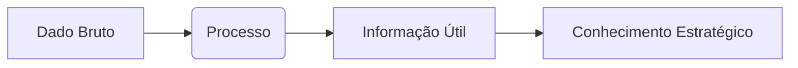

# Aula 04 - Fundamentos do SIG 📄
## Da Informação ao Conhecimento Estratégico

---

## Agenda 📅

1. O que é um SIG? (Os 3 Pilares) <!-- .element: class="fragment" -->
2. Dado vs Informação vs Conhecimento <!-- .element: class="fragment" -->
3. A Importância Organizacional <!-- .element: class="fragment" -->
4. Visão Sistêmica e Custos <!-- .element: class="fragment" -->
5. Prática: Analisando com o SIG <!-- .element: class="fragment" -->

---

## 1. O que é um SIG? 🧐

- Conjunto de componentes que transformam dados. <!-- .element: class="fragment" -->
- Apoio total à tomada de decisão. <!-- .element: class="fragment" -->

### Os 3 Pilares
1. Tecnologia (Hardware/Software) <!-- .element: class="fragment" -->
2. Pessoas (Operadores/Gestores) <!-- .element: class="fragment" -->
3. Processos (Regras de Negócio) <!-- .element: class="fragment" -->

---

## 2. A Hierarquia do Conhecimento 🧠



- **Dado**: "45". <!-- .element: class="fragment" -->
- **Informação**: "Vendemos 45 itens hoje". <!-- .element: class="fragment" -->
- **Conhecimento**: "Precisamos repor o estoque amanhã". <!-- .element: class="fragment" -->

---

## 3. Por que investir em um SIG? 🌟

- **Redução de Custos**: Fim dos desperdícios. <!-- .element: class="fragment" -->
- **Vantagem Competitiva**: Informação é poder. <!-- .element: class="fragment" -->
- **Fim do "Operar no Escuro"**. <!-- .element: class="fragment" -->

---

## 4. O SIG em Operação no Terminal 🚀

```termynal
$ sig-analisar --vendas-junho
[PROCESSANDO] Analisando metas...
STATUS: 92% Atingido.
DADO: 1.200 Airfryers vendidas.
SITUAÇÃO: 80% vendidas com cupom de desconto.
INSIGHT: O cliente só compra se houver promoção ativa.
$ sig-alerta --gerencia
ALERTA: Revisar margem de lucro da categoria 'Cozinha'.
```

---

## Resumo ✅

- SIG envolve Tecnologia, Pessoas e Processos. <!-- .element: class="fragment" -->
- Informação sem contexto é apenas dado. <!-- .element: class="fragment" -->
- Conhecimento gera ação e lucro. <!-- .element: class="fragment" -->

---

## Próxima Aula: Tomada de Decisão 📈

- Como o gerente escolhe o melhor caminho? <!-- .element: class="fragment" -->
- Sistemas de Apoio à Decisão (SAD). <!-- .element: class="fragment" -->

---

## Dúvidas? 🤔

> "Informação é a resolução da incerteza." - Claude Shannon
