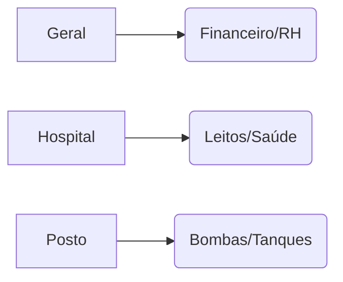

# Aula 07 - SIGs de Nicho e Sistemas Verticais 🧪
## Especialização Tecnológica por Setor

---

## Agenda 📅

1. Sistemas Genéricos vs. Verticais <!-- .element: class="fragment" -->
2. SIGs de Setores Críticos (Hospital/Indústria) <!-- .element: class="fragment" -->
3. Gestão em Atividades de Risco <!-- .element: class="fragment" -->
4. Integração: O "Nicho" conversa com o "Todo" <!-- .element: class="fragment" -->
5. Consulta Técnica por Setor <!-- .element: class="fragment" -->

---

## 1. Sistemas Verticais (Nicho) 🏢

- Focados em regras específicas de um setor. <!-- .element: class="fragment" -->
- Exemplo: Um banco precisa de um sistema que processe **milhares de transações por segundo**. <!-- .element: class="fragment" -->
- Exemplo: Uma fábrica precisa de um software que entenda o **tempo de parada da máquina**. <!-- .element: class="fragment" -->

---

## 2. Comparativo de Setores 🔬

| Setor | Diferencial do SIG |
| :--- | :--- |
| **Hospitalar** | Prontuário e Gestão de Leitos |
| **Bancário** | Segurança Extrema e Fraudes |
| **Industrial** | Controle de Produção e Sensores |

---

## Foco dos SIGs Verticais



---

## 3. Atividades de Risco ⚠️

- Aviação, Usinas Nucleares, Hospitais. <!-- .element: class="fragment" -->
- O SIG exige **Redundância de Dados**. <!-- .element: class="fragment" -->
- **Logs Imutáveis**: Nada pode ser apagado por segurança. <!-- .element: class="fragment" -->

---

## 4. Prática: Consulta Vertical 💻

```termynal
$ sig-industrial --status-maquina 07
[LENDO SENSORES] Temperatura: 85°C.
[ALERTA] Manutenção necessária em 48h.
$ sig-hospitalar --leitos-disponiveis
STATUS UTI: 2 Disponíveis | 3 Aguardando Alta.
```

---

## Resumo ✅

- Um sistema para todos nem sempre funciona. <!-- .element: class="fragment" -->
- Sistemas verticais respondem a regras de nicho. <!-- .element: class="fragment" -->
- Segurança e rastreabilidade são vitais em sistemas críticos. <!-- .element: class="fragment" -->

---

## Próxima Aula: Comunicação Empresarial 📞

- Modelos B2B, B2C e C2C. <!-- .element: class="fragment" -->
- Tecnologia EDI: Sistemas que conversam sozinhos. <!-- .element: class="fragment" -->

---

## Dúvidas? 🤔

> "A ferramenta deve se moldar ao negócio, e não o contrário."
