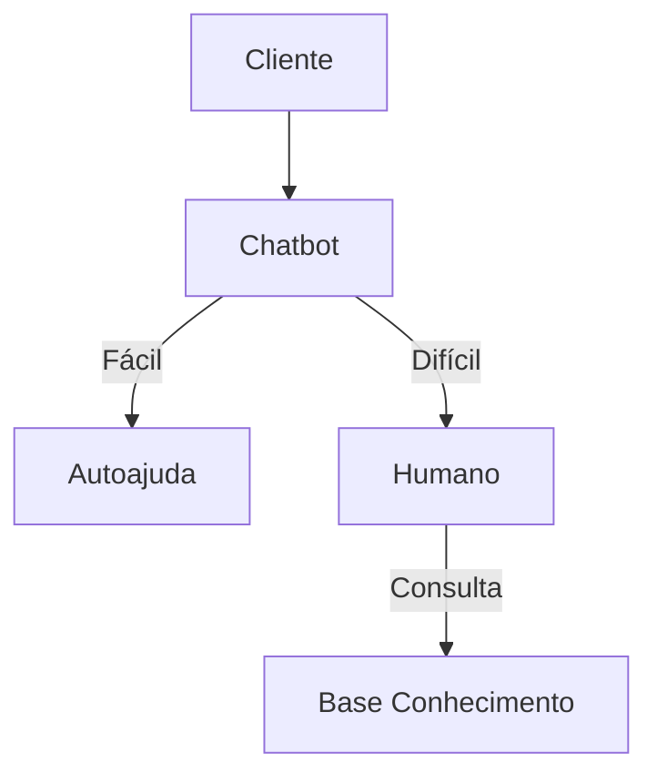

# Aula 11 - Suporte ao Cliente: SAC e FAQ 🎧
## Omnichannel e a Base de Conhecimento

---

## Agenda 📅

1. SAC 4.0: O Atendimento Omnichannel <!-- .element: class="fragment" -->
2. FAQ e o Autoatendimento (Self-Service) <!-- .element: class="fragment" -->
3. Gestão de Tickets e Prazos (SLA) <!-- .element: class="fragment" -->
4. Base de Conhecimento: Inteligência Coletiva <!-- .element: class="fragment" -->
5. Operação de Suporte no Terminal <!-- .element: class="fragment" -->

---

## 1. O Que é Omnichannel? 📱

- Integração total de canais (Whats, E-mail, Fone). <!-- .element: class="fragment" -->
- O cliente nunca repete a mesma história. <!-- .element: class="fragment" -->
- Visão única do cliente no CRM. <!-- .element: class="fragment" -->

---

## Fluxo de Atendimento Moderno



---

## 2. Help Desk e SLAs 🎫

- **Ticket**: O número de rastreio do problema. <!-- .element: class="fragment" -->
- **SLA**: O compromisso de tempo para resposta. <!-- .element: class="fragment" -->
- Priorização baseada na gravidade da falha. <!-- .element: class="fragment" -->

---

## 3. Prática: Atendimento via Sistema 🚀

```termynal
$ sac-listar-tickets --prioridade "Alta"
[ID-990] Cliente: João | Assunto: "Atraso Entrega".
$ sac-assumir --id 990
[OK] Atendente Ricardo logado no caso.
$ sac-consultar-kb --termo "logistica atraso"
[SUGESTÃO] Enviar cupom 'DESC5' e pedir desculpas.
$ sac-responder --status "Resolvido"
```

---

## Resumo ✅

- Omnichannel é o padrão de excelência. <!-- .element: class="fragment" -->
- FAQ reduz custos e empodera o cliente. <!-- .element: class="fragment" -->
- Base de conhecimento agiliza o treinamento da equipe. <!-- .element: class="fragment" -->

---

## Próxima Aula: Comunicação Corporativa 📧

- Boas práticas no E-mail e Chat. <!-- .element: class="fragment" -->
- Trello e Asana: O fim do "caos" de e-mails. <!-- .element: class="fragment" -->

---

## Dúvidas? 🤔

> "O bom atendimento é invisível. O mau atendimento é inesquecível."