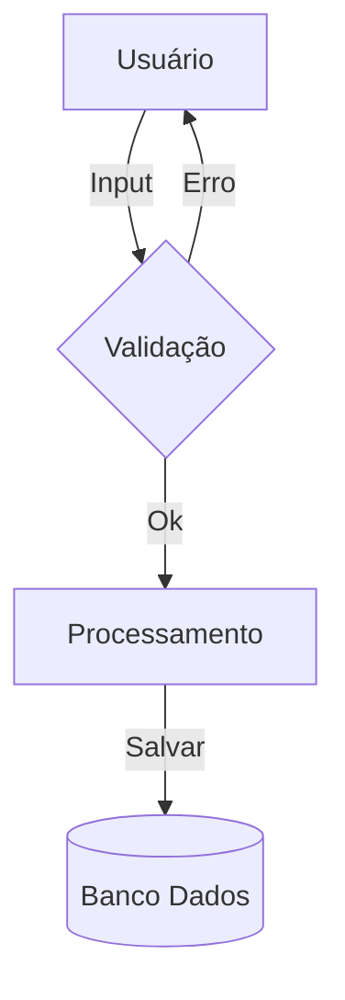

# Aula 13 - Gestão de BD: Entrada e Processo 🗄️
## O Cofre da Informação Corporativa

---

## Agenda 📅

1. O Banco de Dados como Ativo Estratégico <!-- .element: class="fragment" -->
2. Entrada de Dados: Máscaras e Validações <!-- .element: class="fragment" -->
3. O Motor de Processamento do SIG <!-- .element: class="fragment" -->
4. Integridade Referencial (Dados Relacionais) <!-- .element: class="fragment" -->
5. Processando Dados no Terminal <!-- .element: class="fragment" -->

---

## 1. Entrada: A Porta de Vidro 📝

- O banco de dados só é útil se o dado for limpo. <!-- .element: class="fragment" -->
- **Máscaras**: CPF, CNPJ, Data, CEP. <!-- .element: class="fragment" -->
- **Regras**: Preço não pode ser negativo. <!-- .element: class="fragment" -->

---

## 2. Camada de Processamento ⚙️

- Onde o dado vira informação. <!-- .element: class="fragment" -->
- **Cálculo de Impostos** automático. <!-- .element: class="fragment" -->
- **Conversão de Moedas** e Unidades. <!-- .element: class="fragment" -->

---

## Fluxo: Input -> Validação -> Processo



---

## 3. Integridade Referencial 🔗

- Tabelas estão ligadas entre si. <!-- .element: class="fragment" -->
- Ex: Não existe Venda sem um Cliente cadastrado. <!-- .element: class="fragment" -->
- O sistema impede a criação de "dados órfãos". <!-- .element: class="fragment" -->

---

## 4. Prática: Processamento de Venda 🚀

```termynal
$ bd-processar-venda --cliente "990" --item "Pão"
[VALIDANDO] Cliente localizado.
[PROCESSANDO] Qtd: 10 | Preço: 0.50.
[TOTAL] R$ 5,00 calculado.
[ESTOQUE] Reserva de baixa realizada.
[OK] Transação salva com sucesso no BD.
```

---

## Resumo ✅

- Validação na entrada evita o caos no futuro. <!-- .element: class="fragment" -->
- O processamento automatiza as regras de negócio. <!-- .element: class="fragment" -->
- Bancos de dados relacionais garantem a conexão lógica. <!-- .element: class="fragment" -->

---

## Próxima Aula: Saída e Feedback 📊

- Transformando o BD em relatórios e gráficos. <!-- .element: class="fragment" -->
- O ciclo de ajuste estratégico da empresa. <!-- .element: class="fragment" -->

---

## Dúvidas? 🤔

> "Um banco de dados bem estruturado é a fundação de uma empresa sólida."
